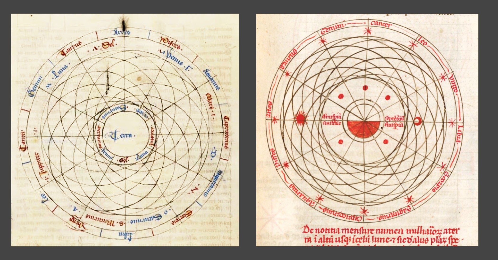
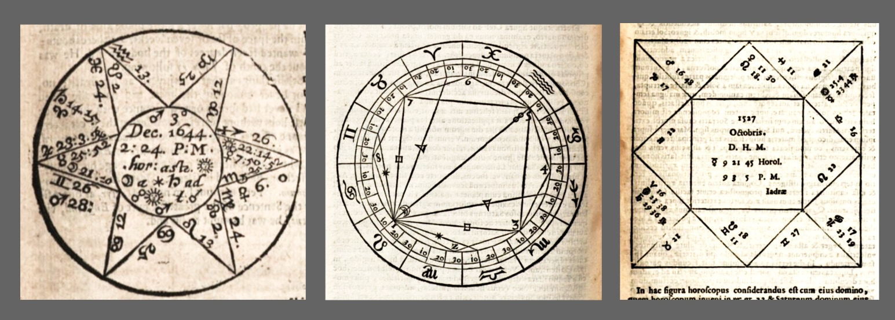

# Planet labels in Voynich manuscript

_If you have any follow up questions about this text or would like to receive updates, you are more than welcome to follow me on Xitter: [@oshfdk](https://twitter.com/oshfdk). If you want to suggest any specific corrections, you can also open an Issue for this repository, but I cannot promise anything wrt response times. If you just want the executive summary of this text and don't mind missing all the fun and pictures on the way, you can skip to the [conclusions](#conclusions) section at the very end._

I caught a cold and decided this was a good excuse to spend a few days on something I planned to do since last year: trying out different ways to match the 7 possible planet labels to Zodiac signs on f67r2 of Voynich manuscript (VMS). I think it's likely someone else has done this before, but I never came across any of the results.

## The basic idea

On folio 67 recto on the right side there is a circular diagram divided into 12 segments with some text in each and what appears to be an additional word or a couple of words in seven of the segments. This arrangement has been described, for example, in D'Imperio 1978, page 17, and I'm not sure who first suggested the segments refer to Zodiac signs and seven labels refer to classical planets (Sun, Moon, Venus, Jupiter, Mercury, Mars and Saturn). I think I came across this idea on [voynich.nu](http://www.voynich.nu/q09/index.html#f67r2), by Rene Zandbergen. This idea has also been discussed recently in a thread on [voynich.ninja](https://www.voynich.ninja/thread-3991.html), which worked as a nice reminder for me.

If these labels really represent the planets and the segments are the signs, then the planets on this chart are associated with 7 out of the 12 Zodiac signs, one for each. Counting from the top oKal label clockwise, the arrangement is: one label, one space, four labels, two spaces, one label, one space, one label, one space. Is it possible to identify the planets, the signs or any other information without considering the labels themselves and only using the pattern they form on the circle?

Here's the image of this diagram on the left as is, on the right with the labels highlighted in green and the pattern spelled out.

[](#knowhere)

_Disclaimer 1: I'm not an astrologist, astronomer or historian, and I'll be trying to make conclusions based on my skimpy understanding of all these fields, so my reasoning may not be precise or fully correct, take the rest of this text with a grain of salt. I'll try to provide some references and lay out my arguments step by step. For the rest of this text I will call the 12 segments 'Zodiac' or 'signs' and the 7 labels as 'planet labels', but it's important to remember that so far we don't know for sure whether these labels have anything to do with the signs or the planets (or their associated gods, metals, mottos in various traditions). This is just one of the assumptions that I'll be making here._


## Is there any meaning at all?

First thing to consider, could this arrangement be random? Maybe the author put the planets with the zodiac signs just for illustration, without any specific order. Or, if the manuscript is nonsensical, these labels could be meaningless, with 7 random segments hosting 7 arbitrary scribbles to make it look like a planet chart. If the author's goal was to confuse or create nonsense, then there might not be much we can do. However, it's worth noting that the labels don't seem to be evenly spread out. There's one group of four labels in a row, while the other three labels are scattered. It's possible to make a very weak argument that when people arrange things randomly, they usually don't create clusters like this. The following images of illustrative astronomical charts show planets in random spread out patters.

[](#knowhere)


Another possibility is that the pattern was created by filling the slots one by one following a simple rule, like starting with 'oFar oeoldan' in the lower right and moving counter-clockwise, increasing the spacing between labels by one every three of them. This would result in the pattern of three labels in a row, followed by three labels with one space between them, and then the final label after two spaces. There could be many rules like this that fit, but none of them seem straightforward or supported by anything else in this chart. This method resembles the process of filling out a complex aspects chart in astrology. We'll discuss these types of charts later when we talk about astrological models.

[](#knowhere)

We can also look at the sizes of the labels, text blocks, and segments to see if there's a geometric explanation. The segments are not all the same width, with the largest segment containing the longest planet label: 'oFar oeoldan'. It's unclear why the segments have different widths. The lines dividing the segments don't meet at a single point in the center of the diagram, and only two of them come close to the center of the circle. Two horizontal lines are parallel but vertically offset, possibly to avoid crossing the text block on the left side and the label on the right side. One line, between two segments in the lower left, is missing entirely, and it looks like it would be hard to put it there without touching either of the text blocks. All of this doesn't give the impression of a carefully planned design. It seems like the lines were added later to separate the text blocks. This contrasts with most astrological circular horoscopes, which typically have precise angles and well-thought-out designs achievable with basic tools like a compass and ruler, something that the creator of this chart obviously had access to.

[](#knowhere)

In summary, if there is a purpose to this chart, it's most likely in showing the order and relationship between the text labels, rather than any precise geometric arrangement or visual aesthetics. For the rest of this text, we'll only consider sequential arrangements related to the Zodiac and the planets.


## Astrology 101

When I first started investigating this chart, I spent a few hours studying it with my basic understanding of folk astrology, which is what most people pick up from reading horoscopes in magazines or learning about their zodiac sign. It turns out I made some simple mistakes that probably rendered all my initial efforts irrelevant. So, if your knowledge of astrology is at a similar basic level, it might be a good idea to get a quick astrology primer. I won't repeat the disclaimer mentioned earlier, as it applies to the entire text, but please keep in mind that I've learned most of this in the past 72 hours, except for basic astronomy. My perspective and conclusions have shifted dramatically during this time, so there might be some important things I'm still missing. If you're well-versed in astrology and reading this, I'd welcome your comments and feedback.

Feel free to [skip](#matchmaking-the-planets-and-the-signs) this section, if you are familiar with the Solar system and basic astrology.

### What's Your Zodiac Sign?

Most people know their Zodiac sign, which is determined by the date of your birth. For instance, if your birthday falls between September 23 and October 22, your sign is Libra. What is Libra and why is it Libra for these dates only?

Libra is a constellation, which is a group of stars that appear to form a certain shape in the night sky. Long ago, people noticed these shapes and gave them names, forming stories and myths around them. Constellations aren't a natural part of the Universe's structure; they are simply random patterns that distant stars form when seen from Earth. They don't have clear natural boundaries, and their exact form and meaning depends on interpretation. Although these patterns change over time, it happens incredibly slowly. Most stars in the sky don't visibly change their position relative to other stars for thousands or even millions of years. Exceptions, like the famous Barnard's star, are rare. Constellations serve as a fixed and universal backdrop for astrology.

In contrast to these distant stars, planets of our Solar system visibly move in the sky. Some people have a hard time visualizing this, so the following analogy might help. Think of yourself in a huge public square with a few other solitary people walking in circles around a central monument. All the people you see will be on the same horizontal line because you all are standing on the same pavement. Noone is above or below anyone else. At any moment, you could say something like, "There is this person to the left of the City Council" or "Do you see that building behind the monument?" Even though the monument and the buildings are fixed, from your perspective the house behind, to the left, and to the right of the monument changes depending on where you are on the square. In this analogy, the houses around the square are like constellations, the monument represents the Sun, and you and the other people represent the planets. If you start round the square, you will see the buildings behind the monument change one by one and by the moment you finish the circle you've seen the monument in front of every building on the square.

[](#knowhere)

In the same manner, when Earth travels around the Sun, the Sun seems to move through different constellations, spending a few weeks in each of them. Although we can't see these constellations during the day, you can catch a glimpse of the constellation that hosts the Sun for about half an hour just before sunrise or right after sunset. Since stars are incredibly distant, it doesn't matter where on Earth you are; for everyone, anywhere, the Sun seems to be in the same constellation on any given date. The Sun appears to complete a full circle through these constellations in a year, spending a few weeks in each one in the same order, year after year. These constellations along the Sun's path are known as the Zodiac, and the one the Sun currently stays in is called the current Zodiac sign. At least, that is the idea, but actual astrology is more complicated.

If today is October 2nd, you might think the Sun should be in the constellation of Libra since the current Zodiac sign is Libra. But that's not really true. Right now, on October 2nd the Sun is between Virgo and Leo, two constellations behind Libra. It doesn't enter Libra until November. We'll explore reasons for this later when we discuss astrological calendar models. The important thing to remember for now: in order to understand an astrological chart it's not enough to know what happens in the sky, you also need to know how exactly a certain school of astrology would interpret this.

### The planets and their games

Apart from the Sun, there are six other bright objects in the sky that slowly change their positions in relation to the constellations: the Moon and five planets that you can easily see without a telescope: Venus, Jupiter, Mercury, Mars, and Saturn, ordered by how bright they are on average.

These seven objects are known as the classical planets, which means 'wanderers' in Greek. They follow roughly the same path across the sky because all the planets in our solar system move in nearly the same flat plane (like on the public square above).

Each of the planets passes through the same constellations as the Sun, entering and leaving them, but moving at different speeds. Sometimes they go slower, sometimes faster, and occasionally they catch up with one another or even change direction.

This game of tag in the sky certainly looks intriguing, so it's not a surprise humanity has been paying attention for millennia. And tried to draw conclusions from different planets entering and leaving constellations, sharing them, meeting one another, etc. With time more and more rules and concepts were added or discovered, so by the the time the Voynich manuscript vellum roamed the Earth in its animal form, there were already many different ways in which planets and stars were believed to interact or relate to each other in astrological models.

We can categorize these relationships into three types: permanent, based on time and place, and based on the calendar date.


## Matchmaking the planets and the signs

The simplest planetary relationships to analyze are the permanent ones, those that are explicitly defined by astrological models and never change. Most western medieval texts seem to agree on them. The primary type is known as rulership or domicile. In this relationship, each of the seven planets has dominion over one or two of the zodiac signs. The correspondences have shifted somewhat with the discovery of Uranus and Neptune (and later Pluto, though I'm not certain if they are being rolled back now). For now, we'll stick with the traditional version. 

The domiciles for the planets are defined as follows: The Sun and the Moon rule over Leo and Cancer, respectively. Mars rules over Aries and Scorpio. Venus has authority over Taurus and Libra. Mercury presides over Gemini and Virgo. Jupiter governs Sagittarius and Pisces. Saturn takes charge of Capricorn and Aquarius. The following is a rulership chart and dignities table from Enarratio elementorvm astrologiae, Valentin Naibod 1560, showing basic relationships between the signs and the planets.

[](#knowhere)

Throughout the rest of this text, we'll assume that the zodiac signs on the chart follow their usual sequence. The standard direction for the circular zodiac is counterclockwise, which mimics the Sun's movement across the constellations as observed from the northern hemisphere. However, for most scenarios, it's quite simple to consider both directions.


### Domiciles

Could it be that f67r2 displays a chart of Zodiac rulership with all seven planets? Normally, each of the signs should have a planetary label, but let's consider that, for some reason, the author chose to show only one of two signs for each planet.

Let's try matching the signs and the labels. The Sun and the Moon govern two neighboring signs: Leo and Cancer, the warmest months of the year in the Northern Hemisphere. These planets should be next to each other on the domicile chart, so they must appear in the sequence of four labels in a row, as the other three planetary labels are solitary. They can't be in the middle of this sequence, as the slots on the left and right would belong to Gemini and Virgo, both ruled by Mercury. If we expect to find all seven planets on this chart, then Mercury can't be mentioned twice. Therefore, there are only two possible positions for the Sun and the Moon: at the beginning or at the end of the four-label sequence. Since the rulership chart is symmetrical, we can match the Zodiac in either direction.

We can use the rulership chart from Naibod 1560 and try overlaying it with the Voynich pattern, both ways. One position creates a conflict with Venus, which appears twice on the chart. However, the second option matches without any conflict. This allows for two possible interpretations, with the Zodiac going in either direction. The usual counter-clockwise direction begins with the Moon and proceeds as follows: the Moon, the Sun, Mercury, Venus, Jupiter, Saturn, Mars.

[](#knowhere)


The label correspondence for this chart is:
- _yToaiin_ - the Moon in Cancer
- _oFar oeoldan_ - the Sun in Leo
- _oPcholdy_ - Mercury in Virgo
- _oKain am_ - Venus in Libra
- _oKal_ - Jupiter in Sagittarius
- _dalchsody_ - Saturn in Aquarius
- _yFain_ - Mars in Aries

In this mapping, the label for the Sun is the longest, but it could also mean something like "the principal sign". On a related note, if you compare the 12 "moon faces" on f67r2, the one next to "oFar oeoldan" appears the largest, making it stand out visually. It's tempting to interpret this label as either the Moon or the Sun. Nevertheless, if there is any significance at all, it could also represent a supermoon or another astronomical or astrological feature.


If for some strange reason the Zodiac is reversed in a clockwise direction, the sequence becomes: the Sun, the Moon, Mercury, Venus, Jupiter, Saturn, Mars.

The label correspondence in this chart is similar, except the Moon and the Sun switch places, and all the other planets change their signs: 

- _yToaiin_ - the Sun in Leo
- _oFar oeoldan_ - the Moon in Cancer
- _oPcholdy_ - Mercury in Gemini
- _oKain am_ - Venus in Taurus
- _oKal_ - Jupiter in Pisces
- _dalchsody_ - Saturn in Capricorn
- _yFain_ - Mars in Scorpio


Considering all of this, it's quite possible that this chart represents a partial rulership diagram. One thing that's bothering me is the Sun and the Moon are at the bottom right, which is unusual. Most medieval Zodiac rulership charts I've seen place the Sun and the Moon at or near the top. Other arrangements are more likely to appear on a horoscope or natal chart, where the angle is dictated by the time and place of divination. We'll discuss this later.

I was looking for a nice illustration for the Sun and the Moon being on top in old books and manuscipts, when I've noticed this particular example from ~1500 edition of classical Opus Sphericum (De Sphaere Mundi) by Jonannes of Sacrobosco, _which has exactly the same arrangement_ as f67r2, only rotated approximately 160 degrees counter-clockwise. It's shown on the left here, on the right is the recto of the same page, which is not relevant, but I just loved the finger of guidance on the margin.

[](#knowhere)
The whole book is available from the site of [Bayerische Staatsbibliothek](https://www.digitale-sammlungen.de/en/view/bsb00004749?page=14).

Here's f67r2 and the illustration from De Sphaere Mundi rotated 160 degrees clockwise, with planets highlighted on both images.

[](#knowhere)

As you can see, the Sun is in Leo and the Moon is in Cancer (almost on the border with Gemini, though), so De Sphaere follows the domicile pattern here. The shapes of Venus and Mercury symbols are indistinguishable on this chart, but the order of their rings from the center puts Mercury in Virgo and Venus in Libra, creating the four in a row sequence. The characters for Jupiter and Saturn here look confusing to me, but again the order of the rings would put Jupiter in Sagittarius and Saturn in Aquarius. The positions of the planet labels in VMS match the planets on this chart. I've overlaid the rotated images on f67r2 for clarity. On the right is the correspondence between the VMS labels and the planets as seen on the chart from De Sphaere Mundi.

[](#knowhere)

_I will not be attempting any deciphering of the Voynich script in this text, however, I can't help but notice that this particularly short **oKal** label for Jupiter almost screams _Ζεύς_ or _Jove_. Wouldn't putting Jupiter on top make sense for Greek or Roman worshipers? This would explain the strange angle of the chart in VMS. Also, Jo- **ve** and **Ve** -nus mapping to **oKal** and **oKaiin** presents an interesting argument for various character shuffling/permutation theories._

So, where did this specific version of Sacrobosco's work get this chart? It's obviously inspired by domicile relationships between the planets and the signs, but why were these particular houses chosen for planets that have dual domiciles?

I've checked other editions of De Sphaere Mundi I could find online, including those older than ~1500 edition, all have the same copy of another chart of planets, which displays a very simple configuration with all planets in one row. Did this change all of a sudden at the end of XV century?

[](#knowhere)

_Edit: after finishing this text I found two more examples of the planetary chart in other editions of De Sphaere. [One from 1494](https://www.digitale-sammlungen.de/en/view/bsb00029417?page=9) shows the same domicile-based pattern I noticed in ~1500 edition. It even has the planet names spelled out, helps to remove any confusion about unreadable symbols. [The other from 1559](https://www.digitale-sammlungen.de/en/view/bsb11109883?page=7) shows an unremarkable pattern with all planets in sequence with no attempt to match the domiciles._

[](#knowhere)

Is there any particular feature in this chart from the 1494 and ~1500 editions that would make it stand out among other possible domicile charts? The following are some of all possible mappings of 7 planets to their domiciles. Night and day domiciles are shown with black and white symbols, respectively, as defined in Naibod 1560 table above. There seems to be no particular intrinsic reason for the arrangement used in De Sphaere, however, borrowing from the discussion of Calendar models later, I've also marked on this chart the only (there is indeed only one) possible real-life configuration of the Sun, the Moon, Mercury and Venus where they all appear in their domiciles in the sky.

[](#knowhere)

Interestingly, it's only the Mercury that has to switch to its night domicile (as per Naibod 1560) for this chart to work. Let's check how night and day domiciles might relate to the moon faces on f67r2. I've used the table from Naibod and marked the corresponding segments with N and D, if the signs correspond to the chart in De Sphaere.

[](#knowhere)

It looks as if the golden moons show night domiciles and the red moons daytime domiciles, but there is a problem. Two luminaries - the Sun and the Moon, which are marked as both day and night in Naibod 1560, are usually associated with the day and the night respectively. But on f67r2 the moon faces are swapped here, with the Moon sitting over a red moon and the Sun sitting over the golden moon. _I have a hypothesis that [the Moon and the Sun are actually swapped here](./noteon72r3.md), and this is what the moon faces indicate._

What if we change the direction of Zodiac? This won't help, the Sun would be over the red moon, but the red moon would correspond to night-time domiciles for the rest of the planets.

So far I see no satisfactory explanation for this particular arrangement of the moon faces. One possibility is that two planets sitting over golden moon faces - the Sun and Mercury - can only be seen when the sky is bright, the rest of the planets (including Venus, when it's two signs from the Sun, as it is here) can be seen on the dark night sky, and so their labels sit over the red moon faces. Not sure if that's the intention behind this coloring scheme and what would be the meaning of 5 faces that have no planet labels (4 golden and 1 red).

In any case the same arrangement of planets in VMS and De Sphaere Mundi needs an explanation.

Is it possible that this edition of De Sphaere Mundi borrowed the chart from VMS, or vice versa or could they both reference some older, maybe Hellenic, tradition? 

I'm not sure what would be the proper astrological term for when each planet stays in its own domicile; I'd simply call this configuration "full house". Is it possible, that this particular full house displayed in De Sphaere reflects some real configuration seen in the sky on some day? Could both the ~1500 edition of De Sphaere and Voynich MS independently refer to some astrological event in or before the XV century? We'll try to answer this question later with a computer simulation.

After we explore other potential astrological interpretations, we'll compare them to see which one appears the most plausible. For now, we have two initial candidates, one of them supported by an almost identical chart in an almost contemporary work.


### Other possible permanent relationship charts

There are other permanent relationships between planets and the Zodiac, collectively known as essential dignities. These include detriment (the opposite sign to the domicile), exaltation and fall, triplicity, decans, and terms. The following table from Alcabitii Ad Magisterivm iudiciorum astrorum Isagoge (1521) lists some these. As a side note, it took me a while to identify curious headphone-like symbol, that appears among the planets. Turns out these are the lunar nodes: points where the Moon crosses the ecliptic, similar to equinoxes for the Sun.

[](#knowhere)

The detriments would have the same planet labels as mentioned earlier and would place Aries at the top for counter-clockwise Zodiac. This is one possible interpretation for the chart, aligning with the domicile interpretation but reversing the direction.

Exaltations and falls are intriguing because they involve only seven signs. However, as you can see in the attached drawing, for exaltations, three signs are grouped together at the top, with another two side by side in opposition, which doesn't match the layout on f67r2. It's worth noting that on exaltations and falls charts, the Sun, the Moon, and Venus are often grouped together.

Triplicity groups Zodiac signs into threes and associates them with classical elements: Fire, Earth, Air, and Water. Each group has a pair of ruling planets: one for daytime and one for nighttime. This requires a total of eight rulers. With only 7 planets, one planet may rule over two groups (Venus being the daytime ruler of Earth and Water in Hellenistic astrology), or one planet may rule both day and night (Mars being round the clock ruler of Water in Medieval astrology). I tried to find a scheme that would match day and night rulers to the red and golden moons on the VMS chart but couldn't find a plausible match. There are only two planetary labels over the golden moons, with the remaining five over red moons.

I couldn't easily identify a meaningful way to match other astrological concepts, such as decans and terms, with the pattern on f67r2.


### Zodiac signs or Houses?

Before we explore other astrological models, let's take a brief look at signs and Houses. Both of these concepts usually divide the sky into 12 segments.

Zodiac signs typically divide the sky into 12 equal sections of 30° each. This division is linked to the constellations in the sky. It can either be permanently fixed, as in sidereal (star-based) astrology, popular in the medieval East, or slowly shifts, changing at a rate of about 1.3° per century to account for the Earth's axis precession, as in tropical (season-based) astrology, popular in the medieval West.

The issue with relying solely on Zodiac signs for divination is that not much changes in the celestial reference frame on any given date. The Moon is the fastest classical celestial body when moving through the Zodiac, covering about 13° per day and staying in the same sign for two days. Other planets move between constellations once or twice a month on average. Predictions based solely on Zodiac signs would provide the same results for anyone or anything on the same date. It is possible to slightly improve this by further subdividing Zodiac into thirds of a sign, however, this doesn't fully resolve the problem of giving identical predictions for events occurring around the same time. To provide individualized predictions based on exact time and place, astrological Houses are used. It's worth noting that in English literature, "Domiciles" (Zodiac signs holding various planets) are sometimes also referred to as "Houses," so it's important to consider the context when reading about them.

Proper astrological Houses divide the visible sky into 6 sections starting from the horizon. These sections can vary in width, depending on the astrological model. Then they are mirrored through the central point to create 6 more symmetrical houses in the invisible sky below the horizon. Unlike the signs, the Houses depend on the time and place of observation. This means that planets and signs would correspond to different houses at noon compared to five o'clock, or if you were in London versus Baghdad at the same universal time. The Houses are usually numbered counterclockwise, with the first house directly below the eastern horizon. Their numbers reflect the order in which they appear in the visible sky during the first 24 hours after the moment of divination.

Houses and Zodiac signs are often depicted on the same chart. Typically, the first house begins on the left side below the horizontal line representing the horizon, and Zodiac signs are shifted to show their actual position relative to the horizon.

If we momentarily set aside all other considerations and focus solely on the 12 segments on f67r2, do they seem more similar to signs or Houses?

Signs: They are always of equal size, so the actual displayed size is not very important, and they are typically marked by names or special characters.

Houses: They can vary in size, so they are usually drawn carefully to show their dimensions. They start from the horizontal line and are numbered 1 to 12 in a counterclockwise direction. They are also reflected through the central point, meaning that the starting points of opposing Houses should lie on the same line.

The horizontal lines on f67r2 are perfectly parallel but offset. This is more likely due to using a fixed horizontal ruler or writing prop rather than being part of the design. It's difficult to determine whether the labels are numbers or names since there is nothing on the page that appears like character sequences. However, it's possible that the numbers could be spelled out as words. It's also worth noting that opposing segments are not of the same width, and the segment lines do not align precisely across the central point. The following image compares the Voynich MS chart with the segment lines highlighted vs a horoscope from Christian Astrology by William Lilly, 1647.

[](#knowhere)

Despite the same generic circular shape and the division into 12 segments, these charts don't appear to have much in common in the way the information is presented.

On the other hand, if the diagram in the Voynich manuscript doesn't depict a real astrological chart but is instead a template describing different features of Houses, then it might not need to be drawn with absolute precision. In general, there isn't enough evidence to strongly favor one interpretation over the other. It's also a possibility that this chart represents both signs and houses, specifically at a moment when the dividing point between two signs aligns perfectly with the horizon line. This alignment occurs every two hours. In this case, for purposes of matching label patterns, we can consider this chart as a chart of signs.


### Time and location models: individual horoscopes

The most widely known astrological charts are those that connect signs and planets to a specific time and place for an event on Earth, essentially mapping out how the celestial configuration appeared from that location at that specific moment. These are commonly referred to as natal charts, House charts, or individual horoscopes. These models are notably the most intricate ones, as they employ various methods to divide the sky into Houses, often of varying sizes. They also utilize aspects, which are predefined relationships between signs or planets, and possess numerous distinct characteristics. To accurately incorporate the influence of both place and time on the chart, precise measurements of angles between various celestial objects and the horizon or meridian are necessary. Charts of this type typically represent these angles either graphically or numerically. Additionally, these charts employ concepts like symmetries, bisections, trisections, and other geometric primitives. The following image shows a circular horoscope, a chart of aspects and a rectangular horoscope from the XVI-XVII centuries.

[](#knowhere)

Navigating through all these intricate models in search of matches with f67r2 would be an exceptionally challenging task. However, I believe we don't need to pursue this course. It appears quite evident to me that f67r2 lacks any precise geometric structure. Not only do the segment lines not align as shown earlier, but the fundamental concept of circular horoscopes, where opposing Houses should have equal widths, clearly doesn't apply to f67r2. Without precise angles and a visual geometric layout, a horoscope would serve no useful purpose.

This leaves us with the possibility of a numerical diagram that depicts various angles as numbers. However, such diagrams have some internal structure connecting Houses or signs, a feature that is absent on f67r2. 

It's possible that the text blocks within the segments contain the necessary numbers and references for a horoscope, but this would be an unconventional way of presenting this data compared to the charts I've encountered. The closest I can think of is the following chart from William Lilly's Christian Astrology (superficially similar to the spiral diagram on f68v of VMS) which shows most of the numerical data within evenly spaced narrow spiral bands. This juxtaposition also works great as a reminder that visually similar designs could be completely unrelated. At least I think they are.

[](#knowhere)

Even if f67r2 represents a simplified House chart, in many cases we can still approach it in the same manner as the calendar models, assuming that all signs are shifted by an unknown angle and their width changed within 50% - 200% of their original dimensions, without altering their sequence. 

Summing up, the general idea of a House chart is to provide the customer with impressive and accurate in depth analysis based on high precision data. That's not the overall impression that I get looking at f67r2.


### Calendar models

Calendar models are a simpler subset or the foundation of time and location-based models. They focus solely on tracking the apparent movements of the planets from one constellation to another, without considering the specific time and place of observation. Unlike natal charts and individual horoscopes, which are created for particular events like births or battles, calendar models were used for broader predictions affecting everyone over a period. Think of the horoscopes you see in newspapers and magazines, offering advice for everyone born under a specific sign. These models rely solely on which planet is located in which Zodiac sign in the sky. Is it possible that the chart on f67r2 represents the real positions of the planets for some past date, like Mars being in Leo, Venus in Scorpio, and the Sun in Libra, for example?

The layout of f67r2 allows for presenting all the necessary information expected from such a chart: Zodiac signs, planets, and commentary on each planet or sign. While some of these charts display the angles of planets within their signs, this isn't essential for divination and is mostly included as a reference in case the chart is used as the basis for an individual horoscope.

One thing that suggests this possibility is the sequence of four planet labels in a row on f67r2. Such sequences often appear in planet charts for purely astronomical reasons. Mercury and Venus have much tighter orbits around the Sun than Earth, so they never appear far from the Sun as seen from Earth. Mercury can be at most 28 degrees away from the Sun, and Venus 47. Considering that one Zodiac sign spans 30 degrees, it means that real Mercury cannot be more than one sign away from the Sun, and Venus is usually within one sign as well. On a real sky chart, there would be at least three labels close to one another: the Sun, Mercury, and Venus. So, even without complex calculations, we can deduce that on a genuine planetary chart, two out of the four labels "yToaiin," "oFar oeoldan," "oPcholdy," and "oKain am" would represent the Sun and Mercury, and it's highly likely that Venus is also among them, unless it's an uncommon configuration where Venus is two signs away from the Sun. This rare setup is only possible if "oKain am" represents the Sun, "oKal" stands for Venus, and "oPcholdy" denotes Mercury. That's the extent of what can be inferred from a casual examination of this chart.

## Piggybacking on NASA JPL computations

But we can do much better, thanks to modern technology. One can say astrology is not rocket science, but no-one prevents us from applying parts of actual rocket science to medieval astrology. We can leverage the computational models developed by NASA Jet Propulsion Lab to predict the positions of all planets for any moment in time between 3000 BC and 3000 AD. However, before we proceed, it's important to issue another disclaimer, out of respect for NASA and the field of rocket science.

_Disclaimer 2: I have absolutely no idea how NASA models work internally. I have some school level understanding of Kepler's law and as far as I can see the model uses some values and their first order derivatives and then adds higher order correction factors for outer planets to compute the heliocentric coordinate and then convert it to something called J2000 frame. My understanding fails to pass the basic test of being able to identify and fix errors in this model, so, for example, if predicted results did not match known historical configurations, I wouldn't know how to approach this. I've tried to follow the procedure described at [https://ssd.jpl.nasa.gov/planets/approx_pos.html] as strictly as possible and checked the results of my implementation against NASA Horizons system for a few dates in the past, they matched reasonably well. However, NASA Horizons web interface doesn't let you specify dates earlier than the XVI century for many computations, so even when my code finds a match for the XI-XV centuries, I cannot fully verify it independently. I will try cross-checking some results with popular online astrology calculators that will let you compute for any year AD, but they seem a bit off even for dates in XVII, that I can confirm with NASA Horizons. In any case, more salt advised for what happens in the following part of this text._

We'll get somewhat technical now, if you are not interested in the details of the computer simulation, you can skip to the [conclusions](#conclusions) below.

We will attempt to simulate astronomical charts for several centuries in a quest for the configuration that resembles f67r2. This will only work under two assumptions:
1. We can accurately compute the celestial coordinates of the planets. While I have confidence in NASA's models, I'm less certain about the precision of my specific implementation and interpretation of the results.
2. We understand how medieval astrology measured the positions of the planets and interpreted the data. Here, I am on much less solid ground, as different schools of astrology employed various approaches.

A very good test of both assumptions would be to locate an old planetary chart or horoscope, and then attempt to reproduce it using NASA's model. Let's take the following chart from William Lilly's Christian Astrology. We'll feed the angles from this chart into the model and make it guess the XVII century year and date. If we let the model use the angles directly, it is possible that because of some quirk in computations, the model will just infer the day from the angle of the Sun and the year from the angle of Saturn, so we will additionally limit the model by only considering the relative angles between the planets to find the best match. Not only will this provide a much more robust test for the model, this way it's possible to bypass the problem of correctly identifying the vernal equinox ICRF RA for dates in the past. After we find the match we can independently check our estimation of the zero angle by comparing the angle of the Sun. (_Having re-read the passage above, I see that it gives the impression that I'm talking about some kind of machine learning or adaptive model, I'm not. The model is a chain of simple deterministic computations following the instructions from NASA JPL site._)

[](#knowhere)

The model will try all configurations in the sky between 1600 and 1700 with a step of 6 hours, so it will try 4 configurations per day, or approximately 146 000 per century. It will find the best matching configuration for the diagram in Christian Astrology using only the relative angles between the planets.

And this is the result:
```
Looking for a match for horoscope: {'century': 1600, 'Venus': 9.16, 'Mercury': 350.1, 'Sun': 1.2, 'Moon': 193.37, 'Jupiter': 118.24, 'Saturn': 45.18, 'Mars': 115.4}
Best match on Y1647.23 1647-03-23 13:06
Angle for Venus computed as 9.1 versus 9.2 in the horoscope
Angle for Mercury computed as 350.4 versus 350.1 in the horoscope
Angle for Sun computed as 0.9 versus 1.2 in the horoscope
Angle for Moon computed as 197.0 versus 193.4 in the horoscope
Angle for Jupiter computed as 118.2 versus 118.2 in the horoscope
Angle for Saturn computed as 45.7 versus 45.2 in the horoscope
Angle for Mars computed as 115.6 versus 115.4 in the horoscope
```

First thing to note - the date is almost correct. The chart says 1646/7, probably referring to Zodiac year March 1646 Aries - March 1647 Pisces. Just in case, I've manually checked with NASA Horizons, in 1646 Mars and Jupiter weren't anywhere near this close when the Sun was near the equinox. So the chart is for March 1647 and our model successfully identified this configuration as March 1647 among all other years and dates in the XVII century. The date is off by 12 days, but in XVI-XVII there was a calendar hell in Europe with different people using Julian and Gregorian, the reform of 1582 shifting the date 10 days forward. I suppose 10-11 days of the error are due to the difference in calendars and 1-2 days due to our simplified approach of converting years to days, without explicitly computing the leap years.

If we ignore the Moon for a moment, the angles are matched within 0.5°. The positions are computed at 6 hour intervals, the time it takes for the Earth to cover approximately 0.25° of its orbit around the sun. Most likely, some of the discrepancy comes from this discrete sampling, it would be easy to test this by substantially increasing the sampling rate. In any case 0.5° is good enough for computing visitor charts. 

The error for the Moon is much bigger, but I'm using a much more crude model for the Moon, because I couldn't properly add its orbit to the NASA model. So the Moon is simulated as having a circular orbit with the same period as the actual Moon. From comparing the Moon computations to NASA Horizons data I see that this can give an error of up to 10 degrees on some dates, maybe even more. This shouldn't present a big problem, since the Moon is the fastest moving of all the classical planets, so it will in most situations cover these ten degrees before any other planet switches its sign. When computing the error, the model reduces the weight of all angles that include the Moon by the factor of 100 to avoid overfitting for the potentially erroneous angle of the Moon. (_If you are reading this and would like to help with properly integrating the Moon computations into the model, please, open an Issue or write to me on Twitter._)

It looks like we have a model that can be used to find sky patters in the distant past. Let's try to find all possible matches for Voynich 1-1-4-2-1-1-1 pattern between 3000 BC AD and 3000 AD. This huge range will give us a good understanding of how frequent this pattern is, for practical interpretations we'll focus on XI - XVI. Of particular interest will be configurations that also match the planets and the signs in the specific way used in De Sphaere Mundi.

What do we do more exactly? We sample geocentric sky right ascension angles (in tropical ecliptic frame, as normally was used for medieval astrology) of all 7 classical planets for dates roughly between 3000 BC and 3000 AD, taking four samples per each date at 6 hours intervals. For each sample we also add two configurations with the Moon offset + and - 15 degrees from its computed position, to account for our primitive model for the Moon. As the result we get roughly 3 * 4 * 365.25 * 6000 samples, with the values of 7 planetary angles in each. We map these angles to tropical Zodiac signs. In order to account for possible minor miscalculations or jitter of the vernal equinox, or to avoid misattributing planets in transit, we perform this mapping 3 times, first with the computed angles as they are, and then two times with 1 degree added and 1 degree subtracted from each angle (this can change the sign of planets positioned at sign boundaries). After this we get a list of 12 signs with a counter of planets per each sign. We match this list against the pattern in Voynich manuscript (counter-clockwise, starting from _oKal_): 1-0-1-0-1-0-0-1-1-1-1-0, rotating 12 times to try out all possible starting points. If the patterns match, we print out the list of planets and their signs and the steps we took to arrive at this particular match (day/time, moon offset adjustment, angle adjustment). We only register the first (the latest, since the algorithm works through time periods in reverse) occurrence for any combination, ignoring repeats in the following hours until the combination changes.

I will probably make the code used to perform these computations public, after some clean up.


## Simulation results

Before we look at the results, I need to say that so far it's not a high quality well tested simulation. It's totally possible that there are mistakes and this section will need a rewrite. Also, simulating with 6 hour step leaves a non-zero possibility of actually overlooking the right combination, if it involves some planets in transit. I'll update this part in case there are any new results.

### De Sphaere configuration

I couldn't find any moment in time between 3000 BC and 3000 AD where the planets and the signs would form the perfect domicile chart from De Sphaere Mundi. Even with +/- 1 degree correction this never seems to happen. One obvious reason for this is Venus required to be two signs away from the Sun, which is already an unusual configuration, even without considering the rest of the planets.

If we loosen the requirements and consider this sequence of planets starting at any Zodiac sign, this configuration only appears once with a -1 degree equinox angle correction: on 16 September 2731 and starts with Jupiter in Capricorn:

_2731-09-16 03:22 Jupiter=oKal in Cap / Saturn=dalchsody in Pis / Mars=yFain in Tau / Moon=yToaiin in Leo / Sun=oFar oeoldan in Vir / Mercury=oPcholdy in Lib / Venus=oKain am in S
co starting at Capricorn days ago -258583.25 correction -1, computed moon in Leo, moon angle correction 0, 010011110101_

It's unlikely VMS or De Sphaere would refer to the XXVIII century or even would be able to accurately compute for it.

### Voynich manuscript pattern 101010011110

On the other hand, if we just look for the basic pattern of planet/empty sign/planet/empty sign/planet/two empty signs/four planets/empty sign, it appears relatively often, about 2-4 times per century before we allow for corrections. In the XV it only happens twice:

_1497-10-19 00:56 Mars=oKal in Aqu / Saturn=dalchsody in Ari / Moon=yFain in Gem / Venus=yToaiin in Vir / Sun=oFar oeoldan in Lib / Mercury=oPcholdy in Sco / Jupiter=oKain am in S
ag starting at Aquarius days ago 192092.0 correction 0, computed moon in Gemini, moon angle correction 0, 101001111010
1461-04-21 20:59 Moon=oKal in Can / Mars=dalchsody in Vir / Jupiter=yFain in Sco / Saturn=yToaiin in Aqu / Venus=oFar oeoldan in Pis / Mercury=oPcholdy in Ari / Sun=oKain am in T
au starting at Cancer days ago 205423.5 correction 0, computed moon in Cancer, moon angle correction 0, 110101010011_

If we consider the possibility of +/- 15 degrees of error for the Moon in our model, the following dates are added to the first half of XV:

_1449-03-12 14:45 Moon=oKal in Can / Saturn=dalchsody in Vir / Jupiter=yFain in Sco / Mercury=yToaiin in Aqu / Sun=oFar oeoldan in Pis / Venus=oPcholdy in Ari / Mars=oKain am in T
au starting at Cancer days ago 209847.25 correction 0, computed moon in Leo, moon angle correction -15, 110101010011
1421-02-07 03:05 Mars=oKal in Tau / Jupiter=dalchsody in Can / Saturn=yFain in Vir / Moon=yToaiin in Sag / Venus=oFar oeoldan in Cap / Sun=oPcholdy in Aqu / Mercury=oKain am in P
is starting at Taurus days ago 220108.0 correction 0, computed moon in Capricorn, moon angle correction -15, 010101001111
1416-04-17 01:41 Saturn=oKal in Can / Moon=dalchsody in Vir / Mars=yFain in Sco / Jupiter=yToaiin in Aqu / Venus=oFar oeoldan in Pis / Sun=oPcholdy in Ari / Mercury=oKain am in T
au starting at Cancer days ago 221863.25 correction 0, computed moon in Libra, moon angle correction -15, 110101010011_

1421 point looks interesting, because it puts Aries at the top of the chart (_oKal_ in Taurus would be to the left of Aries). If we added +/- 1 degree of freedom to the vernal equinox an additional point appears in 1421, swapping the Moon and Venus:

_1421-02-05 09:41 Mars=oKal in Tau / Jupiter=dalchsody in Can / Saturn=yFain in Vir / Venus=yToaiin in Sag / Moon=oFar oeoldan in Cap / Sun=oPcholdy in Aqu / Mercury=oKain am in P
is starting at Taurus days ago 220109.75 correction -1, computed moon in Sagittarius, moon angle correction 15, 010101001111_

Overall it looks like without properly modeling the Moon's orbit it's hard to tell whether this combination of planets actually appeared in the first half of XV century.

I've also checked mid XI century in case this chart refers to the supernova event of 1054. There is only one hit near this date:

_1053-10-05 16:22 Mars=oKal in Cap / Saturn=dalchsody in Pis / Moon=yFain in Tau / Jupiter=yToaiin in Leo / Venus=oFar oeoldan in Vir / Sun=oPcholdy in Lib / Mercury=oKain am in Sco starting at Capricorn days ago 354273.0 correction 0, computed moon in Gemini, moon angle correction -15, 010011110101_


# Conclusions

There are a few plausible candidate mappings for planet labels, let's reiterate our assumptions, questions and basic findings.

1. If the Voynich manuscript is not nonsensical...
2. The chart on f67r2 shows clear resemblance to various planetary charts due to a very characteristic four labels in a row pattern, that naturally arises both in real sky configurations and astrological models from the fact that Mercury and Venus never appear far from the Sun in the sky.
3. In which case two of the four-in-a-row labels are the Sun and Mercury, with a very high probability of Venus also being among the four labels.
4. The pattern on f67r2, if rotated 160 degrees counter-clockwise, matches perfectly with the planetary chart that appears in De Sphaere ~1500 edition, where the pattern is obviously built based on the scheme of astrological Domiciles.
5. If we assume the same principle in VMS, we can spell out the planets and the signs exactly. Curiously, planet labels in VMS roughly match in lengths the corresponding labels in Latin, provided Jupiter is called 'Jove'. The only exception is the Sun, which has the longest label of all the planets. Also, curiously, the moon face next to the position where the Sun would be appears visually augmented.
6. It's not clear, why De Sphaere shows this particular arrangement for the planet chart. I think it's worth investigating where this pattern of putting all planets in their daytime domiciles with the exception of Mercury came from. Obviously, Mercury could be positioned in its nighttime domicile to avoid creating a configuration impossible in real life, but is there any particular reason for putting the rest of the planets only in the daytime domiciles and not, say, just having 7 of them in a row?
7. Alternatively, VMS (and/or De Sphaere, for that matter) could refer to some actual sky configuration on some date. We can use modern computational models to find on which dates configurations like this appeared in the past.
8. The prelimenary results from computational models show that the exact configuration shown in De Sphaere Mundi doesn't seem to appear in the sky between 3000 BC and 3000 AD. I believe this result requires independent confirmation. 
9. On the other hand, configurations of generic type 1-0-1-0-1-0-0-1-1-1-1-0 show up on average 2-4 times per century, and it's possible that a configuration like this appeared in the first half of the XV century. It would take better modelling, especially with regard to the Moon's orbit, in order to study these configurations.


## Other labels on f67r2

If you find any of the mappings above worth further investigation, you may want to look at the segment labels. There are two potential sets of 12 labels, one in red ink running on the outer margin of the circle, the other under the red moon faces. The outer set could also be a since circular inscription, but the breaks in it roughly match the segment boundaries. If this was an ordinary celestial chart from medieval Europe, the items would unroll from the Earth at the center of the image to the fixed stars on the outer edge. The red labels would thus represent the Zodiac signs and the inner set of labels their earthly counterpart: the month names or the seasons. It's possible, though, that VMS describes some fictional world (moon-ruled world, underworld, hell cosmos), in which case anything could be mirrored or turned inside-out.
Speaking of calendars, there were literally dozens of different ways to name the Zodiac and the months in various traditions from Ancient Greece to Western Europe, so I'm not sure how to approach this. For your convenience, the following is the image of the labels as a table, with corresponding signs and planet names, if we assume that VMS replicates the same domicile chart as appears in De Sphaere ~1500 edition.

[](#knowhere)


# Thanks and remarks

I would like to thank everyone in the global Voynich community, all people creating and curating fascinating and thought-provoking essays, papers, sites, blog posts and participating in discussions. This is my first attempt at writing about the Voynich manuscript, I hope you liked it. 

If you need to quote or reference me, you can use my handle [oshfdk](https://twitter.com/oshfdk).
