# Quick overview of distance based ciphers

_This text is one of the series of articles I'm putting together as a part of my self-imposed Voynich decoding marathon. My goal is to publish about once a week until I run out of ideas. Or until the Voynich manuscript is deciphered, whichever comes first. I think one of these events will likely happen before December. If you want to receive all updates, subscribe to my Xitter: [@oshfdk](https://twitter.com/oshfdk)._

_Images in this article contain parts of the scans of the Voynich manuscript from Yale and excerpts from Google Books online collection. All other images as mine. None of the images in this article were generated using AI tools._

_This text reviews distance based ciphers as described in XVI-XVII century literature and tries to identify any possible links between these ciphers and the Voynich manuscript. I do not provide here any direct evidence (i.e., provable decoding attempts) of the Voynich manuscript using any of the ciphers described below, however, these ciphers represent a good example of so-called one-to-many encoding schemes, that can produce multiple encoding variants for the same plaintext. This will be of particular importance in the context of my next text, that I'm about to publish in a few days._

## Original motivation

One of the intriguing features of the Voynich manuscript writing is its very irregular spacing and occasional huge variation in the shapes the letters take. In my opinion, after seeing a few handwritten medieval books, it goes beyond what is expected if we just assume some general sloppiness or illness of the scribe. In many cases the flourishes and the loops seem forced into awkward looking formations as if by some external influence. Is it possible that the deformities of the shapes and the irregular spacing patterns are not accidental but an integral part of the encoding scheme?

This behavior could arise as a by-product of some spacing or distance based ciphers, that are extensively described in XVI-XVII centuries literature. Usually these ciphers are read by measuring distances between certain points or reading symbols located at some predefined distances from one another. The tools used to encode and decode messages in this format are various kinds of regular or customized rulers or a pair of compasses (again, either of the kind we are used to, or of some custom tri-point, proportional, two-plane varieties popular in the past). Given the large number of circular designs with radial elements in VMS, we can assume that the scribe had access to both a ruler and a pair of compasses or equivalent tools. 

Another tell-tale sign of these ciphers is some unusual distribution of elements that appear to form distinct patterns as if governed by some loose set of precedence, again quite similar to what we see in the Voynich script. In this text we'll discuss ciphers of this kind described in two XVI and XVII century works. None of the ciphers listed in these works appear to match the writing of the Voynich manuscript directly, however mixing some features of several of these schemes produces results that appear to mimic some patterns seen in the Voynich manuscript.

The following picture are images of old compasses from various collections, I gathered them online when investigating this last year. These are mostly from XVII-XVIII, but similar designs can be found for earlier periods, I just couldn't find images that would show them well enough to demonstrate how they worked. Of particular interest to this text are the proportional compasses (1), that are used to create upscale or downscale copies, but can also quickly and conveniently read or mark small distances with high accuracy. There is also a pair of astrological or astronomical compasses (3). And even one similar device combined with a scope (4).

[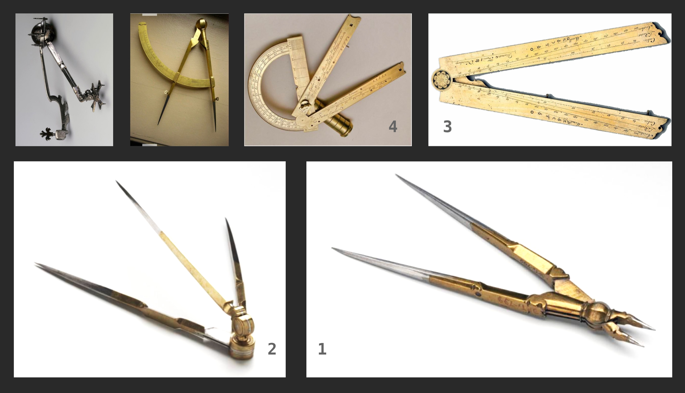](#knowhere)

## The books

We'll focus on two works in particular, because they are available online in full: __Traicté des chiffres ou Secrètes__ by Blaise Vigenère, 1586 edition, in French, and __Cryptomenytices et Cryptographie__ by Gustavi Seleni, 1624 edition, in Latin.

[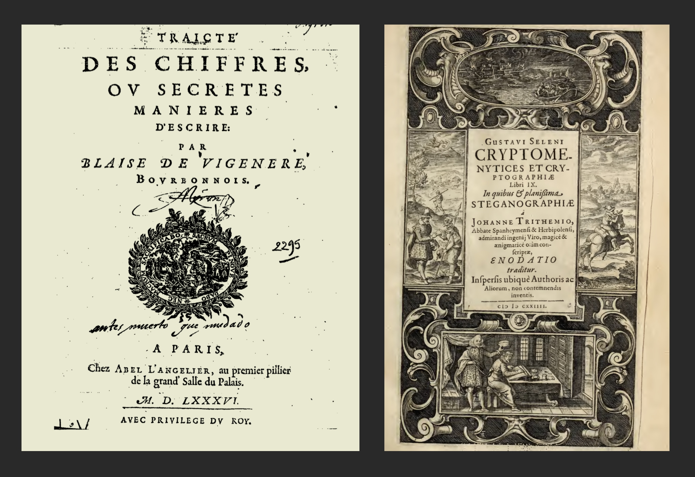](#knowhere)

We'll mostly use __Cryptomenytices et Cryptographie__ as our primary source. It discusses a wider range of ciphers, including almost all of what's available in __Traicté des chiffres ou Secrètes__, but we'll cross reference the older book too, because it's almost 50 years closer to the Voynich vellum animal DOD.

The following image shows pictures from __Traicté des chiffres ou Secrètes__ (white pages) and __Cryptomenytices et Cryptographie__ (yellowish sepia), that demonstrate various distance, width or stroke count based ciphers in action. Interestingly, two of the examples show secret communication using plant images, encoding messages with fruit and leave patterns, and star chart designs, encoding messages with scattered star patterns. Unfortunately, I could find no images that use bathing ladies for this purpose, but this omission can be explained by the censorship. (Just kidding. Although if the authors had some knowledge of VMS, this actually could be the case. At one point in his book Blaise Vigenère discusses in a bit of disparaging manner what dark secrets might these image ciphers contain, to justify choosing that hard to break an encoding. Or maybe this was hidden advertising for using these types of ciphers for particularly sensitive topics, I'm not sure.)

[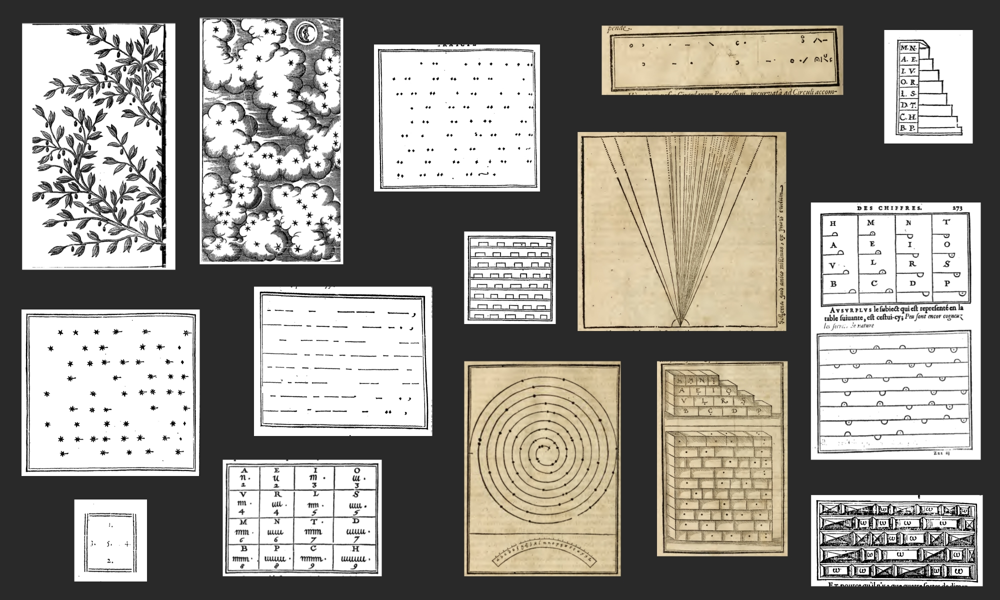](#knowhere)

## Basic principles

Distance or width based ciphers work by creating a mapping between letters and physical distances, usually with secret rulers that have markings corresponding to letters and that you place over the message directly or with a chart that should be used with a pair of compasses, transferring distances to the message or vice versa, as exemplified in the following picture.

[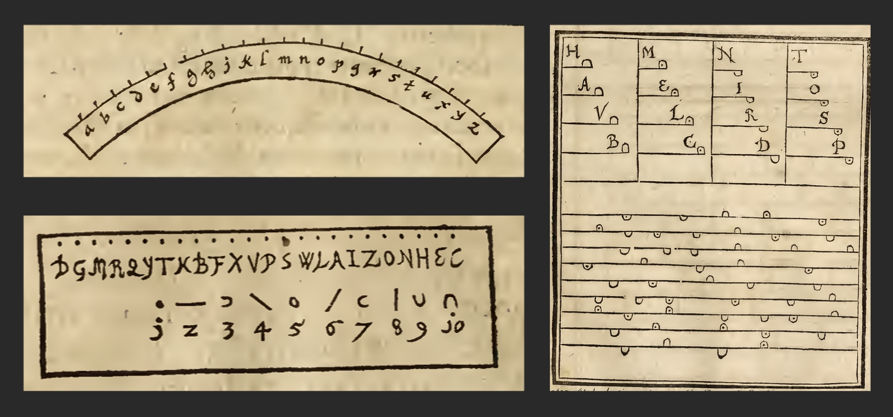](#knowhere)

The simplest algorithm is just putting dots in sequence on a line, circle, spiral or some other linear shape, like a branch or a root[^741]. The distance between two consecutive dots encodes one letter. The problem with this approach is that is takes a lot of space to write even one word. Some usual improvements are using multiple types of marks and alternating encoding direction between left-to-right and right-to-left. It also helps to assign shorter distances to more frequently used letters. The following image gives two examples of using this simple algorithm.
[^741]: I will not be discussing here the methods to hide messages in images of plants mentioned in __Traicté des chiffres ou Secrètes__, but in a few words: the preferred method would be to read the positions of some secondary plant elements (e.g., leaves) with regard to some primary plant elements (e.g., fruits). For example, one leaf to the upper right of a fruit and another to the upper left, with no other leaves nearby would read as letter _F_, etc. If we use all 8 possible directions, and limit ourselves to no more than 2 leaves next to a fruit, to build a realistic image, it's still possible to encode all latin letters (8 choose 2 equals 28).

[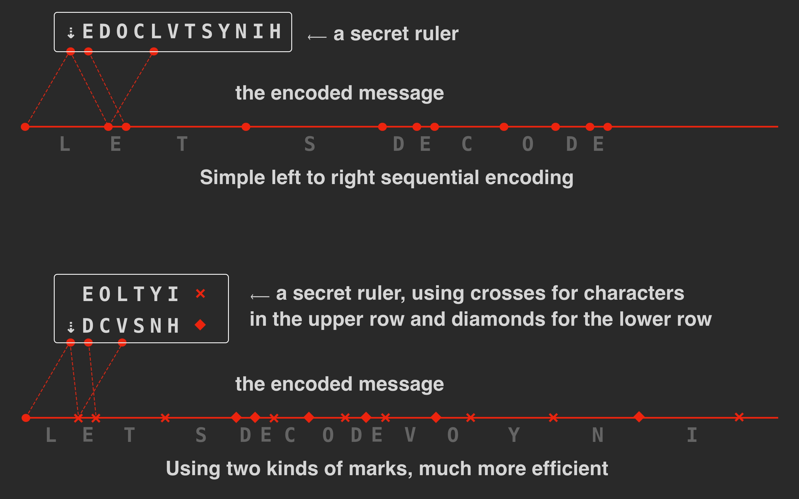](#knowhere)

Fun fact #1: I took an actual pair of compasses to make this picture, holding them next to the display when aligning symbols. It worked much easier than the built in tools my graphics redactor has. 

Fun fact #2: One of the ciphers of this kind in __Traicté des chiffres ou Secrètes__ (next picture) uses stars with varying number of rays to differentiate between several kinds of marks. There are many instances where the Voynich manuscript has designs made of stars with 5, 6, 7, 8 rays.

[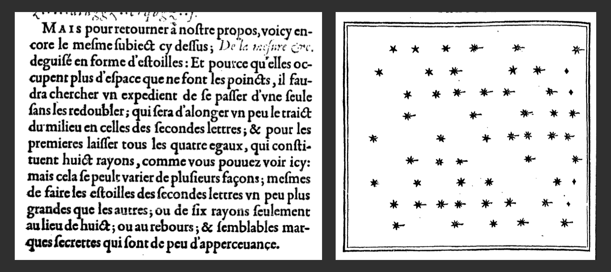](#knowhere)

There are two obvious problems with these simple schemes. First, there is still a lot of empty space between the marks, and the marks themselves look way too obvious. One needs to hide them somehow, one way could be by making them part of the design of some image. Or it might help to write some words between the marks, maybe some random gibberish like "six morix marix vix"[^116]. Alternatively, part of the message could be encoded with a simple substitution cipher, and only a few letters as spaces of various widths between what would be perceived as words of code message. There are no actual spaces in the encoded message, each space itself is an encoded character.
[^116]: As of writing this, I have no opinion whatsoever on whether six-morix-marix-vix part of f116v is meaningful, or if this inscription could be a distance-based cipher, or anything at all with regard to f116v. 

[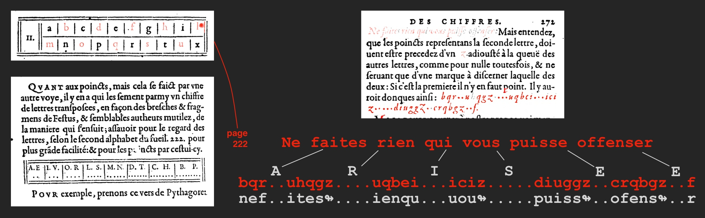](#knowhere)

Note that there is a possible mistake in this code, "offenser" is encoded with one "f", even though double "s" is preserved in "puisse". Overall, encoded books of the past tend to contain enormous number of errors.

The other problem: any particular word, say, "watermelon" will always encode to the same sequence of marks, which is a disaster for an illustrated book. Find one page with a picture of a watermelon, study the patterns and you can uncover hidden watermelons anywhere in the book. How can we fix this?

The following examples are loosely based on ciphers presented in __Cryptomenytices et Cryptographie__ and __Traicté des chiffres ou Secrètes__, they do not appear in the books as is, but represent a mix of techniques actually described there: encoding with pairs of same looking marks read sequentially, encoding with pairs of different looking marks, encoding with pairs or marks read in some predefined order. By simply combining these schemes we can get, for example, the following:

1. We can encode the letters as distances between the same marks, but let the scribe randomly pick marks from a large enough set. For example, suppose the distances to encode "cat" are 8, 2, 6. Instead of writing the marks in sequence like this: `*.......*.*.....*`, we can write them as pairs of arbitrary marks, say, `x.oko...xk`, the distance between x-x is 8, o-o is 2 and k-k is 6. What is more, it's possible to start writing the next word immediately after the second `o`, so we can write "cat cat" as `x.okol..xksrsl...r` (x-x is 8, o-o is 2, k-k is 6, l-l is 8, s-s is 2, r-r is 6). In order to make the encoding look more natural, we can fill the blanks with some extra marks, that never specify actual letters, say: `xeokoli.xksrsliiir`. As you can see, there are many possible ways of encoding a word in this manner.

2. There is another possibility. We can place the marks anywhere on the line but read them in a predefined order. We don't even have to use pairs of the same marks. Suppose, the reading sequence is a-b, c-d, e-f, g-h, i-j, k-l. To encode "cat", we can write `eac.d.f..b`, and read this as a-b is 8, c-d is 2, e-f is 6. If we add another cat, we get `eacidjfgkb....lh`. Or `eacidjfgkbiie.lh`. The letters are always the same, but you can put them in any order you like. This scheme looks very complicated and hard to execute, unless it is supported by a specially designed set of marks that would be easy to read in pairs.

One interesting example is the following cipher from __Cryptomenytices et Cryptographie__ that I found no mention of in __Traicté des chiffres ou Secrètes__. 

[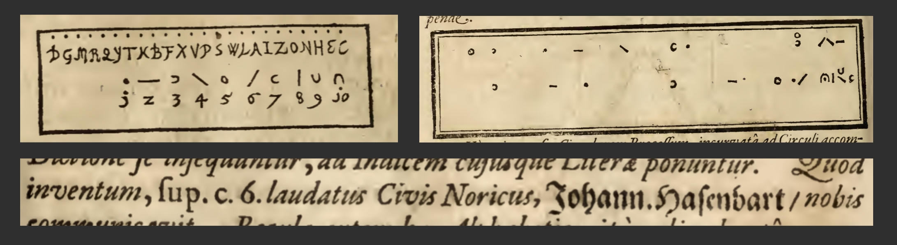](#knowhere)

The author specifically attributes it to a certain Johannes Hasenbart, _civis Noricus_ (somewhere in Alps?). I couldn't find any mentions of this particular Hasenbart online. What's interesting is that this particular cipher uses distances between pairs of dots, lines, half- and full circles rotated in different directions, they can be put on paper in any order, the reading order is shown on the ruler itself. As you can see, this cipher doesn't look particularly camouflaged by itself, but it's possible to hide these marks quite easily in normal looking text as flourishes or letter elements. The predefined reading order for marks will make it much easier to hide them, because you are not limited in where in the text to add them. Without this feature the encoding would look something like the following monstrosities, that basically have "ciphers be there!" written all over the place. (These two pictures show a different type of cipher, but they demonstrate very well the general problem of hiding additional marks in normal writing: the normal writing is way too regular for this.)

[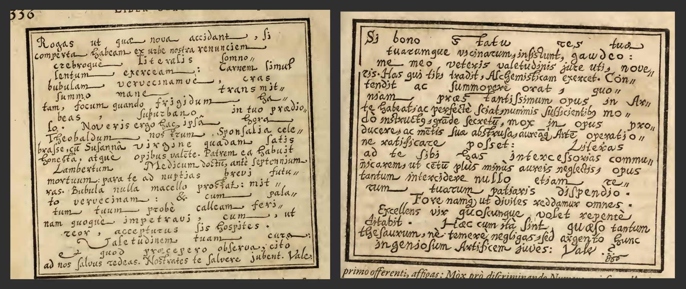](#knowhere)

## How practical are the distance-based ciphers?

One question arises immediately: how easy is it to read and write these distance-based ciphers? I tried it myself and was pleasantly surprised. In less than an hour you can learn to read the codes off the page without any tools, not as easily as you would read English, but at a bearable pace of 2-3 letters per second, and usually you would guess the whole word after 3-4 letters. If the cipher uses some special mark to indicate where the next word starts, you could skip the tail altogether, and the whole process is not really tiresome. Writing is even easier, if you use a ruler with the a step that feels natural for you. 

### A short exercise

Let's have a short exercise. I've designed a simple distance-based cipher, designed to be read off the page, without a ruler. It will only have three possible distances between marks, with the step of about two character widths. This way the distances are very easy to assess: basically the distance is either obviously short, or obviously long or neither. Also, since the shortest distance is two character width, you can put any two characters directly next to one another without forming a pair, this could be useful. The secret alphabet will have only 9 characters and they will be designed for easy visual pairing. The characters are `d, q, o, f, j, +, k, y, v`. There are two ways to group them, either by having an ascender/descender/none, as follows: (`d, f, k`), (`q, j, y`) and (`o, +, v`). Or by the basic shape: circle (`d, q, o`), fork (`k, y, v`) and crossbar (`f, j, +`). If your font doesn't show a crossbar at the top of `j`, just imagine it's there.

The characters will form pairs by their ascender/descender type, if a pair starts with `d` then it should end with one of `d, f, k`. If a pair starts with `o` it should end with one of `o, v, +`. When reading the code, you take the first letter and find the next letter of the same ascender/descender type and note whether the distance between them is short (about 2 characters wide), long (about 6 characters wide) or somewhat in the middle. Then you use this distance and the basic shapes of the two matching characters to find the plaintext character in the table. Then you take the next encoded letter to the right of the first letter of this pair and repeat. Note that you will have to skip the terminating characters that belong to the pairs that you will have already matched. The hard way would be keep track of these, but in a real handwritten code you could just use subtle stylistic variations to mark these characters. This is not necessary to read the code, but greatly simplifies the process. I will use italics for this purpose in the example below, all letters in italics will only terminate pairs. With three possible distances and 9 code pairs we can encode 27 letters, but we need to create a one-to-many cipher, so we'll settle for an alphabet of 12 characters and the space sign `␠`.

The following image has the encoding table on the left, and shows two of several possible ways of encoding 'mouse', showcasing the steps used for decoding. Then there is a long encoded string at the bottom. Can you decode it? If you can, notice how very obvious syntactic structure of the original got completely obliterated by the encoding process. If you have trouble reading this off the page (I doubt I would succeed on the first try), you can write it down and first connect all pairs by their ascender/descender type, verify that the ending characters are in italics and then proceed with the mapping. As you will notice, I smuggled in one extra character `|`, it shouldn't affect your decoding if you do everything right. Can you guess what it does?[^123]
[^123]: Note that if needed it's possible to make this cipher appear more similar to Voynichese visually by employing techniques like mapping ascenders with descenders (matching across the line), etc. My goal was to show the basic working principle of these ciphers and not imitating the Voynich script in any visual sense.

[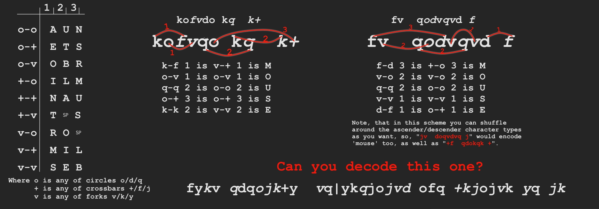](#knowhere)

### Possible improvements

There are a few problems that often appear when encoding in ciphers that work like this. For example, sometimes conflicts in encoding force you to put two symbols in roughly the same place. If you carefully define which part of each glyph should be the measuring point for the encoding and make sure this particular part of the character has some wiggle room, you can resolve some of the conflicts easily. You can also design a script which will let you stack marks on top of each other, or you can use ligatures to indicate that a couple of separate marks should be treated as occupying the same position. It also might help if we add certain characters that would work as an emergency bail out. They probably should stand out clearly in the text and indicate things like: stop the decoding and restart after this character, start here, do not attempt closing any pairs beyond this point, skip everything from this point to the next special character, or similar. 

Line breaks present a special problem for these ciphers, because it's unclear how to measure distance across line breaks. We only used three possible distances in the cipher above, so we could easily break off and continue on the next line. This will not work with a set of 5-6 distances and when writing in narrow columns. One possible solution would be putting some special character at the end of the line to indicate the break up point for all unfinished pairs and then measure the rest of the distance on the following line. If the lines are perfectly left justified, it could be possible to use a special ruler that would let you read or mark the distance across a line break directly, without any calculations. I didn't try this myself though.

Also, when using a cipher like this it may be tempting to reuse portions of the code with some modifications, it makes the encoding process much faster when you can work off an existing template. E.g., if you are encoding a sentence like "auto copying hypothesis can explain many features of the manuscript", not only the shared prefixes of snippets like "many" and "manuscript" can be copied over verbatim, but other snippets that use the same set of distances with a different set of marks could be copied with some minor changes, this optimization can be learned easily. Alternatively, one may want to copy the same repeated word in a slightly modified fashion in order to obfuscate the fact that the word was repeated.

Overall, I find these ciphers much more pleasant to use, resembling lightweight sudoku, compared to purely mechanical one-to-one symbol-based or mathematical codes. Distance-based ciphers require no special mental skills and only a relatively short training period.

## What about Voynich MS?

Is it possible that the Voynichese uses a similar scheme? Three questions immediately come to mind:
1. How anachronistic would that be? After all, __Traicté des chiffres ou Secrètes__ postdates Voynich vellum by some 150 years.
2. Are there any specific instances where a distance-based behavior is clearly present in the Voynich manuscript?
3. If some kind of distance coding is used in the Voynich manuscript, what would it take to conclusively and provably decipher it?

Let's go down this rabbit hole. 

[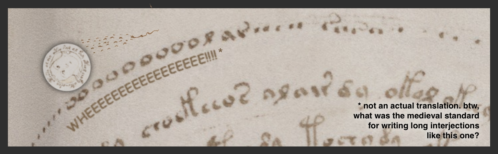](#knowhere)

## How anachronistic are those schemes for the Voynich manuscript?

__Traicté des chiffres ou Secrètes__ published in 1586 discusses these ciphers as old news ("yet another way of writing secret messages is"), putting them in the second half of the book, but I couldn't find any specific references to past works there. __Cryptomenytices et Cryptographie__ provides for these ciphers some references to a book of **Johannes Walchius** published some time in the beginning of the 1600s (judging by scarce references I could find online). 

The first mention of these ciphers in __Traicté des chiffres ou Secrètes__ appears on page 276 (pictured below), immediately after a discussion of one of Marcus Agrippa codes.

[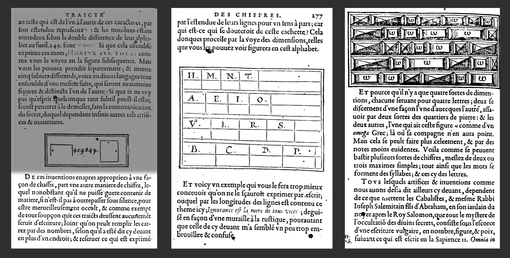](#knowhere)

The bottom of the third page mentions vaguely the Kabbalists as those who are somehow related to all these types of ciphers (probably referring to everything mentioned so far), but doesn't give any specific references. The author doesn't claim, that this cipher is his original invention either. Overall, so far I have found no specific evidence for these ciphers used in XV, but the wording in the XVI century book implies these have been known for a while.

## Are there any instances of obvious distance-based behavior in the Voynich manuscript?

Let's have a look at one of my favorite pages: f57v. I've been carrying a copy of this circular chart in my pocket for over a year and in my free time I studied it using a ruler. To begin with, the chart has some geometrical properties that are not obvious at first sight. One example: the following pairs of symbols are located at precisely the same distance from one another. This could mean, that the author of f57v put special attention to properly arranging some of the symbols on at least one of the circular bands.

[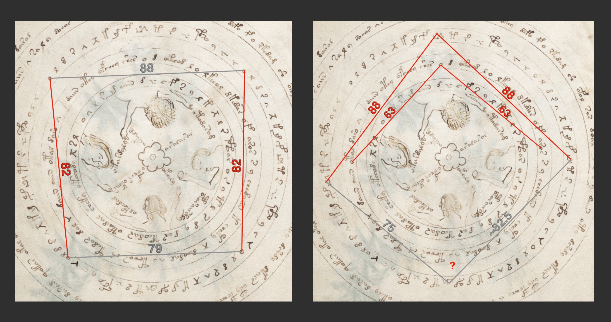](#knowhere)

The starting _o_'s of the 17x4 sequence have two pairs that form segments of equal length. Three `|_/\` symbols on the top form an isosceles triangle with the vertices in the circular symbols over the basic `|_/\` shape. It's also possible, that three _o_'s on one of the inner bands form an isosceles triangle as well.

The most obvious explanation for this geometrical structure is simple: the author just needed some anchor points to properly distribute the symbols over the bands. What's interesting is that this structure mostly works on the upper half of the circle, as if it was very important to make specifically the part from 9 o'clock to 3 o'clock work. Is it possible that this part is a circular ruler?

[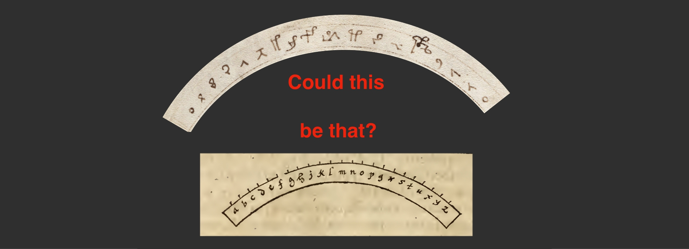](#knowhere)

It's certainly not a secret ruler as is, at least not for encoding latin letters, because there are no latin letters on it. But it can be a tool for some distance encoding method and it could be possible to gain some information from looking at it. Let's measure the angles and the spacing on this band.

[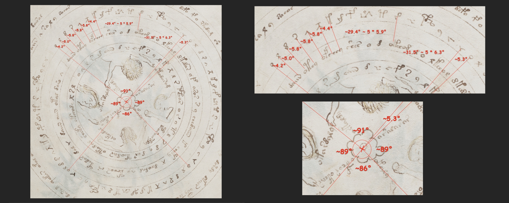](#knowhere)

Interestingly, even though the cloud (or Rosettes?)-like thing at the center of the chart has a very suggestive dot, the circles are not centered at this dot, but a few millimeters to the lower left of it, at a point that I marked with tiny red crosshairs. 

The only quarter on the 17x4 band that is more or less evenly spaced is the top one, and it occupies approximately 91° of the arc _from o to the final symbol of the sequence_. The angle from the first _o_ to the second _o_ is roughly 96.5°. If the top part is the secret ruler, it could be designed to mark 16 intervals on 1/4 of a circle. Average spacing between the marks is 5.6° or roughly 6 mm, if we take the width of the page to be 16.2 cm.

But this is probably not the most interesting thing on f57v, for our discussion. Let's have a good look at the following fragment: the start of the outer ring. The entry point to the whole f57v chart. This thing:

[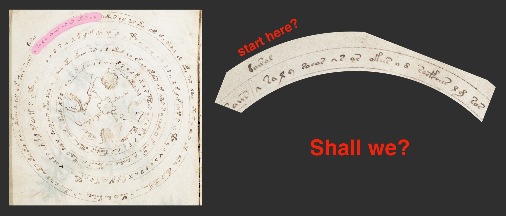](#knowhere)

The sequence starts with a `/\` sign. In the context of distance based encodings I like to think that this symbol could represent a pair of compasses (this is a pure speculation, of course). With the meaning of "start measuring here" or "put your needle here". By analogy `|_/\` could represent two pairs of compasses with some symbol close to their meeting point. I'm not sure about `¯\_`, could this mean moving to the next line? Is it possible that the manuscript, as it has been suggested several times before, is not always written left to right, from top to the bottom? What about the "coffee table" symbol, that looks like `/\` with a line on top? A compass and a straight edge? Square and compasses?

Anyway, let's put the compasses at the top points of two `/\` signs in this sequence. Is there anything else in this part of this band located the same distance apart? Well, there are quite a few things. Let me split this band into two halves, color the characters on the right half green and put one on top of the other so that `/\` signs match. In this arrangement points that are the same distance apart as `/\` signs will appear exactly on top of each other.

[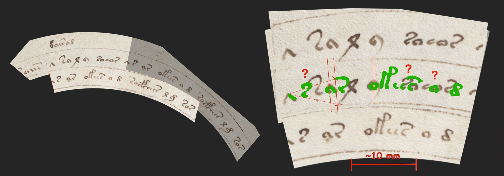](#knowhere)

First thing to note (follow the vertical red lines on the image): EVA "_a_" symbols in both parts match exactly with sub-millimeter accuracy, as well as "_y_" from the first part with "_o_" from the second part. Also the tip of the top flourish of "_r_" from the second part is exactly at the same distance from the tip of the second `/\` as the tip of the bottom flourish of "_l_" from the tip of the first `/\`. The precision with which the points coincide is remarkable. I've put an approximately 10 mm long line at the bottom for comparison. I've computed its length using 16.2 cm as the width of the whole page, which is the listed width of the tome. The matching characters are about 2-3 millimeters wide and the precision with which they match is at least 0.25 mm. If this is intentional, how was it possible to do this at all? It's not very hard really with a good pair of compasses. Proportional ones, like shown at the beginning of this text, would allow to place the anchor dots with even higher precision at any predefined distance, but even the regular ones can easily copy distances with up to 0.1 mm accuracy, leaving a tiny mark or pinprick off which the rest of the character can be drawn.

Do any other characters match and if they do, which parts of them specifically? The next symbol after `/\` in the first part is a bit weirdly looking large EVA "_s_". Its flourish seems a bit exaggerated and left-leaning. There is a regular sized "_s_" at roughly the same position in the second part. The base curvelets of these two "_s_" mismatch by quite some distance, but the upper hooks almost match with the distance between the tips of ~1.3mm. There is also a more of less exact match between two more "_o_" near the end of the sequence and a plausible, but not certain match between two other "_s_" that go before these two "_o_", again, the match is with the hooks only, the bases of the characters stay apart.[^74]
[^74]: There is another possible way to look at this characters. If we are supposed to measure the distance between the extreme points of the characters, then the distance between the tip of "_s_" and the left leg of "_l_" in "_saly_" matches reasonably well with the distance between the tip of "_s_" and the tip of "_r_" in "_sar_". The problem with distance based ciphers is that without knowing the scale and the rules you will see patterns in strokes that match by accident. We'll discuss this a little bit further. One last thing I'd like to mention is that the first four EVA "_s_" symbols at the start of this band form a pattern where the second symbol is located precisely at the center point between the first and the fourth symbols, and the third "_s_" is located precisely in the midpoint between the second and the fourth. Dividing the whole segment into 1/2, 1/4 and 1/4. Overall, I see no easy solution for the task of separating relevant and irrelevant patterns here.

In any case, some of these patterns are probably intentional, what could be the reason for creating them? There are theories out there interpreting the chart on f57v as showing dials on some device (I think I read about this on [Nick Pelling's blog](https://ciphermysteries.com/2018/01/21/might-voynich-f57v-depict-nocturnal)). This could explain why some characters are put at certain regular intervals. However, other than the 17x4 band of characters, there seems to be too little structure in the chart overall. The bands are not clearly divided into segments, and most of them after displaying a few initial patterns revert to almost normally looking Voynichese.

It seems inpractical if the code for the whole manuscript requires such outstanding precision, its production would be a truly herculean task. But what if this particular piece is executed so precisely in order to let the readers better understand the mechanics of the script. Suppose for a moment that f57v is a primer or a key, including the secret ruler and some basic training inscriptions (maybe with f66r providing more in depth information). I'm not sure who was the first to suggest this, but a chart with the highest number of unusual glyphs and a character list seems like a very good candidate. What if it was intended for initiates or students who only learn the script. The primer shouldn't betray the hidden knowledge, but it should help those who want to learn it. Or maybe the whole manuscript is made on the same principle as [Steganographia](https://en.wikipedia.org/wiki/Steganographia) created by Johannes Trithemius circa 1499 and showcasing ciphers not via their explanation, but with a direct demonstration, essentially building a self-referential book of codes, the meaning of which should be uncoded by the reader?

If it is a primer, how does it work? 

Let's digress for a moment. I never studied other medieval handwritten manuscripts before last month. This doesn't portray me as a very dedicated researcher (research is not my job, after all), but maybe this gives me a fresh eye on how well designed these things can be. I'm somewhat familiar with the principles of modern user oriented visual design, I was stunned to clearly see the application of the very same principles in technical illustrations of XIII-XIV century works. Using clear concise labeling, multiple charts to underscore the differences, various types of highlights to better convey the principal message, even using cute animal or human figures to set the right emotional tone. Human ingenuity appears to transcend regularly the limitations of established knowledge and create or invent based on principles that would remain undiscovered for centuries. So, I will approach the question of designing the Voynich script primer as if I was to design it today according to modern educational standards.

I'd start with a picture. A clear image hinting at the very basis of the encoding process, maybe in a bit humorous manner. And I'll put it front and center, so the reader would ponder on its meaning from the very start. If it's a distance-based cipher, the image should include a measuring device and some indication of how to apply it. Even if the script doesn't require any special tools, compasses are a very good simple visual for the act of measuring.

[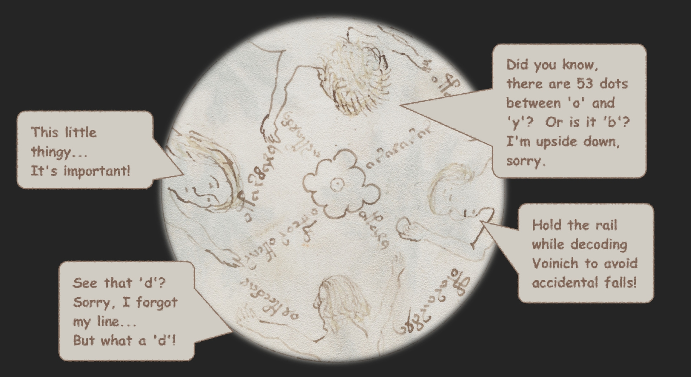](#knowhere)

Well, the top and the bottom figures do look a bit compass'y. And everyone except the figure on the right appear to point at some characters. What is the figure to the right holding up in the air? It could be something as simple as EVA `o`, or it could be the chart itself. I can't tell really. 

The picture as a whole could mean anything, for example, "start measuring from the first _o_ to the first _d_, and then measure the distances between _r_, _o_ and _y_ on the second pass". This is definitely a bad guess, but I couldn't identify any specific meaning in this picture. Maybe someone can see more?

The next obvious point of interest is the "start here" marker and the piece of the outer band that we dissected above. There, if I designed this as a hands-on intro, I would encode in the most basic way possible a certain motto or a well known phrase. Or, if we are showing a one-to-many cipher, I would demonstrate two different ways of encoding the same short string. Could this be the meaning of the repeated sequence we studied above? This is an interesting possibility, if indeed this part of the band encodes the same message twice, we could use this to identify certain properties of the code. We'll discuss this in depth in one of my next articles.

## What would it take to conclusively and provably decipher a distance based encoding?

The simple answer is when we can demonstrate a straightforward, reproducible and unambiguous method of converting Voynichese to some coherent text, preferably relevant to the images, then we can talk about conclusiveness. As far as I know, we are nowhere near this point yet.

For the time being a better question would be what existing information and past research could help us in identifying the properties of a possible distance-based cipher.

### Any information that we already have

If we assume a cipher that works on the same principles that the known ciphers described in the XVI century, the secret ruler is defined by three parameters: the basic step, the number of divisions and the order in which the characters go. Is is possible to extract any of this information from the known properties of the text?

The first thing that comes to mind is the very specific distribution of word lengths, described in the [following article](https://www.ic.unicamp.br/~stolfi/) by Jorge Stolfi. The lengths of both words ("unique words" in common parlance) and tokens (all instances of words in text) conform to a binomial distribution the mean of 5.5, starting from 1, obviously. For distance based ciphers the word breaks are not word breaks as such, but only positions where it's impossible to add a new symbol because either the terminating slot corresponding to this position is already occupied and cannot be shared or there are unclosed pairs for all available marker types. It's possible to put certain plausible limits on the combination of the ruler step and the number of divisions that would produce a distribution with the same mean value and check whether the resulting distribution is binomial. We will discuss this in depth in a future article.

It is also possible to build some statistics by marking actual character locations on a page and then computing all the distances. I spent a while on these experiments, you can see below some cute graphs that I got in the process. I found no significant results. As it often happens, a lot of graphs and images look promising, but they can be reproduced just as easily feeding random noise to the same algorithms.

[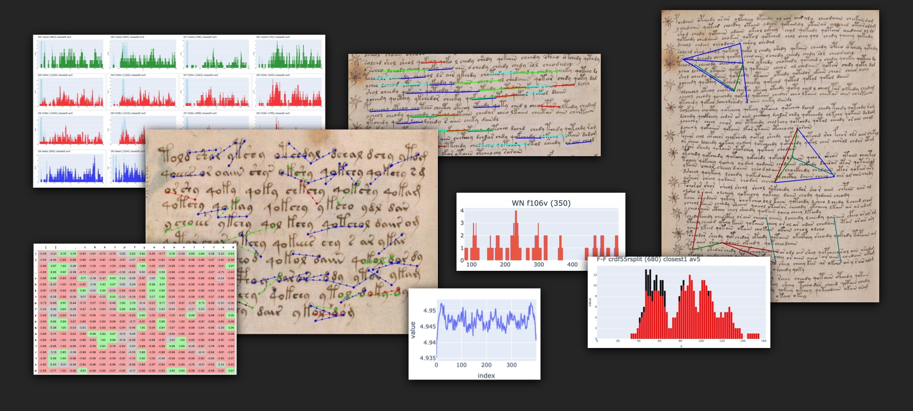](#knowhere)

Before we wrap up, I would like to talk a bit about practical limitations that you can encounter when working with distance based ciphers. We'll use a very familiar prop for this purpose, one that I already hinted at in this text.

## Problems and pitfalls

Let's ponder over f116v for a moment and use it as a learning tool. There is a well known inscription on this page, a few lines, in two of them words are separated with crosses. Let's treat the sequence of crosses there as if it contained some hidden coded message and try to understand what it would take us to decipher it. Spoiler: there will be no break-throughs, but this will helps us understand problems and pitfalls of the distance based encodings. 

On the following image I marked the distances between the crosses on f116v using some arbitrary units.

[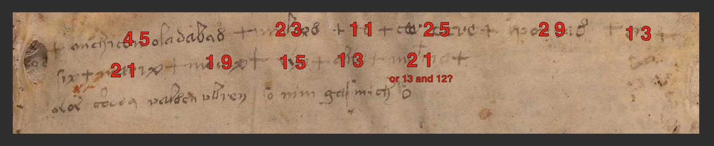](#knowhere)

First thing to note: if you don't have the secret ruler, you have to guess the basic scale, which affects the precision you need to use when measuring distances. We have the measurements of 11, 13 and 15, do they all correspond to the same letter? What about 19, 21, 23 and 25? You can get some idea from the size of the marks themselves, usually they are no bigger than the basic step of the ruler, otherwise the marks would overlap. At the scale I used, most crosses are about 3 to 6 wide, so the basic step should be 5 or more. Also, the vellum doesn't look completely flat, it is possible that the wrinkles in the folio distort the distances to some extent. This wouldn't present a huge problem if you had the ruler and knew the underlying language: when some distance could mean one of only two letters, you can usually pick the right one from the context. But if you have to guess the language, the scale and the mappings at the same time, you can fantasize anything you want, there will be no way to prove you right or wrong. 

Let's think about which of the known methods could be used here. With the simplest that uses only one type of marks and the basic step of the ruler of 5, if we want to encode an alphabet of at least 20 characters, the distances between individual letters will measure up to 100. The whole width of the text on this page is 150, so it would be very problematic to write in this manner. The maximum width actually used on f116v is 45, the minimum is 11. Since the shortest distance in the books above is often equal to the step used and reserved for frequent letters, we can argue that the ruler may go something like 11 - 22 - 33 - 44. With this step length it's impossible to encode an alphabet of more than fourteen different letters for this page width, and very inconvenient to encode an alphabet of more than 7 letters. In principle, it should be possible to encode a Roman numeral this way, any larger set of letters would be problematic. 

Is it possible, that two kinds of marks are used here? I see no obvious candidate for a separate mark, but it's remarkable that almost all of the crosses are preceded by one of four characters: *8* (or EVA _d_), *c* (or EVA _e_), *x* and *a*. The sequence goes `+...8+...8+.c+.....c+...8+?+` (line break) `..x+...x+...x+...x+..a+..(a+)..a+`. As shown in "Ne faites rien qui vous puisse offenser" code before, special symbols preceding the distance marks can be used to map different charactes to the same distance. In which case an alphabet of at least 16 characters could be encoded on this page.

Overall, f116v works well as an exercise, but I'm not sure it (or other marginalia[^91]) would readily yield a key to the manuscript. We'll discuss what I see as more practical approaches in a future article.
[^91]: There is a tiny possibility that one of the pieces of latin marginalia in the manuscript is the secret ruler, after all they contain latin letters put on a single line, and the coded books often included the keys in the past. I haven't yet looked into this possibility.

# Thanks and remarks

I would like to thank everyone in the global Voynich community, all people creating and curating fascinating and thought-provoking essays, papers, sites, blog posts and participating in discussions. I hope you liked my contribution.

If you enjoyed reading this article and would like to get day to day updates on my progress, you can subscribe to my Xitter: [oshfdk](https://twitter.com/oshfdk). If you feel strongly in favor of me continuing with my research as swiftly as possible and you really can afford it, you are much welcome to send any kind of money to my Bitcoin wallet `1AMG4Ny6jrWi9DhYpEiJ7w8Gs5sBfsH6dW` . I only do Voynich research in my free time, and my main income now is roughly proportional to the time I dedicate to my day job, so it's a balancing act for me. By paying for my cup of coffee (of a bathtub of coffee, if you wish) you will actually increase the time I can spend on the Voynich manuscript. No pressure though, I have no plans to give up anyway.

If you need to quote or reference me, you can use my handle [oshfdk](https://twitter.com/oshfdk).
