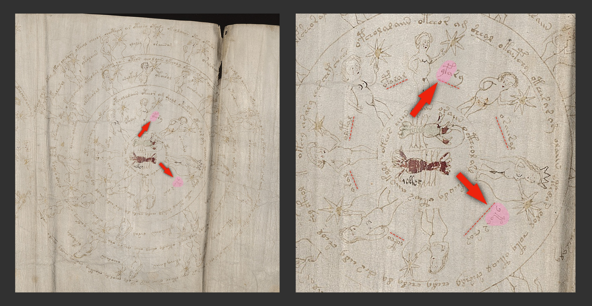
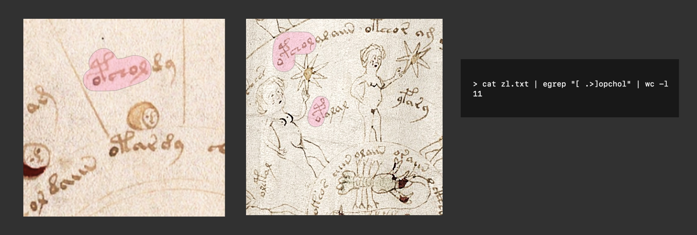

# Let there be meaning


_This text is one of the series of articles I'm putting together as a part of my self-imposed Voynich decoding marathon. My goal is to publish about once a week until I run out of ideas. Or until the Voynich manuscript is deciphered, whichever comes first. I think one of these events will likely happen before December. If you want to receive all updates, subscribe to my Xitter: [@oshfdk](https://twitter.com/oshfdk)._

_Images in this article contain parts of the scans of the Voynich manuscript from Yale and excerpts from Google Books online collection. The rest of the images and the edits to the images are mine. None of the images were AI generated._

_In this text we will try to find out whether the Voynich manuscript contains meaningful text. First we will ponder the definition of meaning and formulate exact steps that we need to take to identify the presence of meaning in the manuscript. Then there will be some lightweight (school level) math and some lightweight (grep/Python level) computer science, but no understanding of either is required to follow my argument. Then we'll discuss the results and will try to put some probability on the presence of some meaning in the Voynich manuscript text. In the end I'll thank everyone and ask for donations._

_Some of the readers will probably notice that I switch a lot between first person singular "I" and first person plural "we" when writing. If you find this annoying, I encourage you to imagine that I choose the plural when my cat is positioned sufficiently close to my computer to become a participant in this effort, and singular otherwise._


## What is meaning anyway?

Before we start looking for signs of meaning in the Voynich manuscript, we need to define exactly what we are looking for. The _meaning_ of meaning seems obvious, but vague, there should be a precise definition if we want a reproducible way of answering the questions about meaning. What specific property should convince us, that yes, there is some meaning in a text?

In general, how can we tell whether some symbols or sounds have a meaning?

### A simple thought experiment

Let's start with a thought experiment. Imagine you landed in a faraway country inhabited by people whose language, customs and culture are completely unknown to you. One of the locals approaches you holding an unknown fruit and says "karmidosa". At this moment, without doing anything else, is there any way to deduce the meaning of this utterance, or if it has a meaning at all? Maybe it means "hello" or maybe it's not customary to greet strangers in this land. Maybe it means "are you ok?", "are you hungry?", "buy this!", "taste this!" Maybe it is the name of the fruit or the name of the person. Or maybe it's just a socially acceptable way of clearing one's throat before speaking.

Without some existing framework it is impossible to deduce any meaning from a single juxtaposition of an utterance and a situation. You can deduce names of fruits from a picture dictionary, because the picture dictionary is designed to show objects and their names side by side, and you know this. You can find out the name of an unknown vegetable among other things on your plate by looking up ingredients in the menu, because you know what all the other items are called. If the only thing you have is one word and one situation, you cannot ascertain anything.

Imagine further that another local passing by stumbles and falls, and someone else seeing this immediately shouts "karmidosa". That's the moment when you can get the first probable idea about this utterance. It's certainly not "buy this!" or "are you hungry?". Most likely it's "are you ok?" or "be careful!" You still cannot be sure, but statistically speaking next time you hear "karmidosa" your first interpretation should be that someone is asking about someone else's wellbeing. The more times you encounter "karmidosa" in different situations, the higher will be your certainty about its meaning.

How to translate this into exact language of probabilities related to texts? Let's try the following definition: 

The presence of meaning in a text correlates with (or leads to) the ability to make statistically significant predictions about objects, properties or behaviors external to the text.

As in the example above, before you heard "karmidosa" the second time, you would have no means of predicting in what kind of a situation you will hear it again, all possible scenarious would have the same default probabilities, and there is no way to pick the most likely of them. But after you hear it for the second time, the probability of "karmidosa" meaning "are you ok?" goes up and the probability of its meaning being "have this fruit" goes down.[^9451] 
[^9451]: Note that until you start hearing other words and identify their contexts, the probability of "karmidosa" having no meaning at all should stay the same, it would still be possible that "karmidosa" is a universal interjection useful in any situation and having no specific predictive power. The whole process of assigning and tweaking meanings is probabilistic in nature and in a sense never ends. If you are being a true Bayesian, you can never posit a 100% knowledge of the meaning of any word. It could be that "the ocean" has always meant breeding grounds for a very large seagull species, and it just happened that on all occasions when you encountered this word, you misunderstood its meaning. Not at all realistic, but technically possible.

Why does the definition say _external to the text_?

### Meaning and structure

Suppose you hear the following sequence of words: oridosa, oridora, oridea, oridosa, oridora, oridea, oridosa... Can you predict what goes next? Sure, most likely it's _oridora_, if the sequence just repeats the third time. So, you can make a prediction, but do you see any meaning in these words? I guess not. I call what we see here _the structure_. The structure lets you make predictions about the text using the information in the text itself, but when it doesn't relate to any external objects, properties or behaviors, the structure doesn't convey meaning.[^5454]
[^5454]: I was asked an interesting question about the meaning and the structure. When the first book of Harry Potter series was published, little in the text would let you make good predictions about the real world. Does this mean the text in the book had no meaning? Of course not, the text lets you make a lot of predictions about the fictional world of Harry Potter series, which is an entity based on the real world and separate from the text and its structure. You can easily demonstrate this by looking at, say, the Chinese translation of Harry Potter, which describes generally the same world, but using completely different text structures.

On the other hand, the structure is a prerequisite of meaning. In the example above, when you heard "karmidosa" two times, you were dealing with the simplest kind of structure there is: exact repetition. If we suppose that in the local language words and expressions are affected by whether you talk to a stranger or an acquaintance, _karmidosa_ could change to, say, _karmirosa_, when local inhabitants talk among themselves. But absent any structure at all, if you heard a new random sequence of sounds each time, it would be impossible to attribute any meaning to any of them.

Summing up, in order to make a statement about the presence of meaning, we can demonstrate the presence of some structure within the text that lets you make statistically significant predictions about objects or properties external to the text. However, it would be a fallacy to talk about predictions when we study an a priori known fully fixed object, so we will reformulate our definition in terms of probabilities.

More specifically, we will proceed as follows: first we'll identify some structure within the text of the Voynich manuscript and compute the probability of this structure appearing by random chance. If this probability is sufficiently low as to warrant further investigation, we will identify external elements visually related to the structure we found and posit some relationship between these elements and the structure in the text. Then we will try our best to estimate the probability of this relationship being accidental or non-accidental, that is, meaningful, as per our definition. 
 


## Hunting for structure

There are many possible ways text can be structured. In this article we'll focus on what seems to be relevant to the Voynich manuscript. Any particular choice of structure doesn't affect the validity of our argument, we are looking for correlations between any kinds of internal and external structure.[^543]
[^543]: As a side-note, this argument wouldn't hold if we were mining for structure by brute-force enumeration of all possible connections between all possible text elements. The probability of any structure to show up by chance is proportional to the number of attempts we take at identifying this structure. That's why the golden standard requirement for the significance of experiments in particle physics is 5 sigmas, which is roughly the probability of tossing heads 22 times in a row. It seems like a highly improbable toss, but the world of particle physics research would not accept your claim that the coin in definitely biased until you demonstrate a 22 in a row. After all, it would take on average _only_ about 4 million attempts to land 22 heads in a row, impossible at home, but quite easy in a lab given sufficient funding.

My present primary area of investigation in the Voynich manuscript is stateful one-to-many additive ciphers that operate on character by character basis. These ciphers encode the plaintext characters one by one or in small groups, appending the result to the ciphertext and possibly keeping track of some internal state, and any character or a combination of characters in the plaintext can map to several possible ciphertexts (by choice or based on the internal state). One important property of these ciphers is that if two ciphertexts starting from a certain cipher reset point (e.g., a new paragraph) share a common prefix, the corresponding plaintexts also share a common prefix (which could be empty). Two copies of the same plaintext can diverge at any point in ciphertext, but as long as the ciphertext remains the same, it corresponds to the same plaintext. A lot of ciphers work according to this description, I thing it won't even make sense to list them here. I talk about one particular example [here](./distance.md). We will look in detail at a few possible examples of these cyphers in one of my next texts.

Accordingly, we'll be identifying structures that present themselves as a match or quantifiable similarity between prefixes of certain parts of the text. For the particular purpose of our argument, we are free to choose any method or metric, as long as it allows us to compute the probabilities.

### Probabilities with rabbits and hats

A quick school-level primer on probabilities. If you know how to calculate the probability of throwing matching values on a pair of dice in two tries, you can skip this section without losing anything.

When talking about the presence of structure in text, we will use the so-called discrete uniform distribution (DUD) as the total absence of structure. In simple terms, if you have 10 hats and there is a rabbit in one of the hats, with the discrete uniform distribution each of the hats has the same probability of hosting the rabbit, one hat is not different from the other. Since we know there is a rabbit somewhere in one of the hats, the probability of it being somewhere in any of 10 hats is 1, and since the probabilities are equal for each of the hats, the probability of the rabbit being in any particular hat is exactly 1 divided by the number of hats or 1/10.

If we have two rabbits in 10 hats, and the hat for each of the rabbits is picked independently according to DUD, what is the probability of two rabbits sharing the same hat? (We assume many rabbits can comfortably fit into one hat, we don't want to hurt the rabbits.) After the first rabbit was put in some hat, there is 1 in 10 chance that the same hat will be picked for the second rabbit too, so the probability of two rabbits sharing a hat is 1/10 or the same as the probability of one rabbit appearing in any particular hat. 

What if we add another rabbit? What is the probability of three rabbits chilling in a single hat? This can only happen if the first and the second rabbit share a hat, which happens with the probability of 1/10, and then the third rabbit ends up in the same very hat, which also happens with the probability of 1/10. When two things should independently happen to get some outcome, the probability of the outcome equals to the probabilities of both preconditions multiplied together: 1/10 times 1/10 is 1/100. You can think of this as follows: 
- Step 1: if we randomly toss a pair of rabbits one by one into 10 hats, only one time in ten tries two rabbits will share a hat. Nine times out of ten rabbits will stay separately.
- Step 2: if we add the third rabbit, only 1 time of ten successful tries from step one the third rabbit will land in the same hat that already has two rabbits in it. Again nine times out of ten the third rabbit will get separated from the first couple. 

So, _on average_ per 100 tries, in 90 of them we won't put the first two rabbits in the same hat, leaving only ten successful tries, then for these ten successful first steps, only once the third rabbit will end up with the first two. The probability of this is 1 in a hundred.

If you asked somebody to randomly put three rabbits in ten hats and you later find out that all three rabbits ended up in the same hat, then you can say it's 99% probability of this arrangement not being random, _as long as this happened only once_. On the other hand, if you asked 100 people to each put 3 rabbits in 10 hats, it's quite likely that you will encounter all three in one hat at least once[^543], even if the selection was truly random. When assessing how likely certain arrangement is, you always need to consider it against all other arrangements or all other attempts.
[^543]: The probability of this is one minus the probability of this not happening on every single try of 100, or 1 - (99 / 100)<sup>100</sup> = 63% approximately, but that's not something we will discuss in this text.

### Prefix probabilities in a text

In [one of my past texts](./README.md) I examined a sequence of 7 labels on f67r2, which had been tentatively identified as possible planet names, in a search for a plausible pattern.

Let's list some of the prefixes of these labels from f67r2, specifically those that appear between 2 and 7 times in the manuscript. These prefixes are _ytoai_/_ytoa_, _dolchs_, _ofar.o_, _yfai_/_yfa_, I've also added their shorter versions that appear on some additional pages, but no more than 7 times in total.

Let's create a table of where they appear and in which form (label, text, circular text). I've additionally put an ellipsis "…" when the snippet is not used as a prefix, that is, appears in running text without a space in front of it. An asterisk marks a prefix, that is just a part of the prefix listed above it. So, for example, f2r lists both _ytoai_ and _ytoa_, but the second is just the prefix of the first on the page, so there is only one planet prefix in total there.

|Prefix|Count|in labels   |2r   |51v  |55v  |58v  |66v  |67r2 |72r3 |73v  |89r2 |95r2 |95v1 |
|:---|:---:|:---:         |:---:|:---:|:---:|:---:|:---:|:---:|:---:|:---:|:---:|:---:|:---:|
|_ytoai_|2|2              |  L  |     |     |     |     |  L  |     |     |     |     |     |
|_ytoa_|3|3               |  *  |     |     |     |     |  *  |  L  |     |     |     |     |
|_dolchs_|2|1             |     |     |     |     |     |  L  |     |     |  P  |     |     |
|_ofar.o_|3|1             |     |     |     |     | …P  |  L  |     |     |     |  P  |     |
|_yfai_|3|2               |     |     |     |  P  |     |  L  |     |  L  |     |     |     |
|_yfa_|7|3                |     |  P? | …P  |  *  |     |  *  |  L  |  *  |     |     | …P  |


All these prefixes are scattered through the manuscript, but there is one other page that has two of them: page 72r3 has both _ytoa_ and _yfa_.

Let's check the size of the block that contains both labels on f72r3, I've highlighted both prefixes in the picture below. 

[](#knowhere)

Both prefixes belong to a clearly separate block of 7 labels going in circle between seven nymphs, which is very convenient for our task. So what is the probability of these two prefixes from our list from f67r2 to appear again by chance in a block of seven labels in a different location in the manuscript? Before we proceed with the calculations, it's very important to note that the choice of f67r2 was not random or a result of any brute-force enumeration. It was a result of tentative identification of planet correspondences that we [made earlier](./README.md). Should our analysis involve comparison of all sequences in the manuscript to all other sequences in the manuscript, we'd have to correct for the number of attempts that we make, but we don't have to do this if we start with a particular sequence in the manuscript.

Let's compute some basic statistics from a transliteration file. I'll be using the transliteration file created by Renè Zandbergen and Gabriel Landini, presently available at [http://www.voynich.nu/data/previous/ZL_ivtff_1r.txt](http://www.voynich.nu/data/previous/ZL_ivtff_1r.txt). In the following excerpts I'll be running UNIX shell commands to extract some statistical information from this file. If you are not familiar with the UNIX shell, you can just read these snippets as follows: each piece consists of a hash sigh "#" followed by a comment where I explain what I'm going to do, then on a separate line there is a command that starts with ">", and then there is the answer that the command produced. To follow the argument, you can just ignore all lines that start with '>' and read the rest.

```
# checking the version of the transliteration file
> cat zl.txt | head -n 3 | egrep -o "[^#]*"
=IVTFF Eva- 1.7
 ZL transliteration file, updated from EVMT project
 Version 1r of 11/04/2020

# approximately how many words tokens are there, considering only
# lines that start with "<f" and ignoring uncertain spaces
#
# we'll assume every lowercase latin letter after a space, a period or
# a greater than sign starts a new word. this way we'll miss all
# cases where an ambiguous reading starts a word.

> cat zl.txt | egrep "^<f" | egrep -o "[ .>][a-z]" | wc -l
35949
```

This looks like a plausible number, other sources mention about 38000 word tokens, but they could also include uncertain spaces. In any case, this number is not really important, as we'll later focus primarily on label statistics, so if the math in the following paragraph looks unclear or you are not certain about its correctness, you can skip it and focus on the math for the labels further on.

Random co-occurrence probability for _yfa_ and _ytoa_ prefixes to reappear by chance in a block of seven words is computed as follows: there are 7 locations for _yfa_ and three locations for _ytoa_ in the manusript, one of them is on f67r2 for both label. So, there will be two other blocks with _ytoa_ and we need to compute probability of one of 6 remaining _yfa_ labels to appear in one of these blocks. One of the 7 slots in these blocks will have been taken by _ytoa_, this leaves 6 possible slots for _yfa_. With seven slots taken by the original labels on f67r2 and one target slot taken by _ytoa_, statistically _yfa_ can prefix any other word in the manuscript with the probability of 6 / (35949 - 1 - 7)[^767], so 2 locations and 6 possible labels and 6 / 35941 probability for each one of them gives the total of 2 * 6 * 6 / 35941 = 0.2%.
[^767]: If you cannot follow the denominator math here or would like to suggest a different approach, let's just say that reducing the denominator of 35949 only weakens the result, but doesn't affect it much. I only updated it throughout the calculations to make sure we stay on the safe side.

However, there is one obvious problem. Since we are looking for structure in the text and both samples that we study are lists of labels, we cannot ignore the possibility that the structure we found mostly highlights the difference between the set of all labels and the set of all words in the text. Let's repeat out computation with the labels only.

```
# number of labels in the manuscript, we will only consider
# full label prefixes, since none of the prefixes we identified
# match mid-label
> cat zl.txt | egrep "^<f[^>]+L[^.]*?> " | wc -l
1033
```

_ytoa_ appears only in labels, three times, but _yfa_ as a prefix appears in labels 3 times out of 4. Again, with one instance of both labels in f67r2, we have two instances of _ytoa_ and two instances of _yfa_ in labels in the rest of the manuscript and we need to compute the probability of them co-occurring in a block of 7 labels. Using the same logic as above, we take two locations for _ytoa_ and compute the probability of _yfa_ to appear in one of remaining 6 slots in either location. 2 * 6 * 2 / (1033 - 1 - 7) = 2.3%. Which is still very low. Nevertheless, this highlights the fact, that removing obvious sources of intrinsic structure of the text could greatly affect the result. To have a more clear argument, going forward we will only consider the set of all labels, it appears that if we find a convincing argument for this set, we can easily repeat it with better results on the set of all word tokens in the manuscript.

Can we consider more data? Let's find another rabbit! While _op_ is a fairly common prefix among those that appear on f67r2, it's still good enough to substantially affect our statistics:

```
# how many labels begin with EVA op or have op after a word break 
> cat zl.txt | egrep "^<f[^>]+L[^.]*?>" | egrep -o "[.> ]op" | wc -l
53
```

Random co-occurrence probability of _yfa_, _ytoa_ and _op_ label prefixes to reappear by chance in a block of 7 labels is the same as the probability of a label starting with _op_ appearing in one of five slots in a block which itself has the probability of 2.3%, or 2.3% * 5 * (53 - 1) / (1033 - 7 - 2) = 0.58%. 

Can we identify even more structure? Let's consider both sets of 7 labels, starting with those that have matching prefixes:

f67r2: **_ytoaiin_**, **_yfain_**, **_opcholdy_**, _ofar.oeoldan_, _okain.am_, _okal_, _dolchsody_

f72r3: **_ytoar.shar_**, **_yfary_**, **_opalal_**, _oraiiral_, _oletal_, _aral_, _octho_

It's tempting to say that _okal_ and _aral_ appear related, but given that _al_ is an extremely frequent suffix, which appears...

```
# number of labels that end in al
> cat zl.txt | egrep "^<f[^>]+L[^.]*?>" | egrep -o "al$" | wc -l
76
```

76 times at the end of labels, or in 76 / 1033 = 7.4% of all labels, matching two labels that only have the length and this suffix in common appears far fetched. It's also remarkable that the label with _ytoa_ prefix appears to consist of two words on f72r3, while the two word label _ofar.oeoldan_ from f67r2 has no obvious two word counterpart on f72r3. I see no other obvious structure here.

So, we can say with high certainty, that the co-occurrence of _yfa_, _ytoa_ and _op_ prefixes from f67r2 in another block of 7 labels in the manuscript is not accidental, but cannot yet say anything specific about the reason this structure exists. What could have created this structure? There are several possible explanations. For example, the way the manuscript was generated favors these prefixes when producing sequences of labels. Or all labels running in a circle form a distinct subset with likely repetitions in it. Or when creating one of these charts the author used the other as the source of random labels. Or, the last but not the least, this structure can be related to external elements (images or layout patterns), in which case this is a sign of meaning, as we defined it earlier. 

Let's consider these possibilities in detail. There are a lot of circular patterns and label sequences in the manuscript, and _ytoa_/_yfa_/_op_ co-occurrence will still look statistically significant if we only considered circular designs, we have a lot of leeway if we start with only 0.58% chance of this arrangement appearing in a random uniform distribution. On the other hand, the hypothesis of auto-copying f72r3 from f67r2 or vice versa is too plausible to just shrug it off. If we consider auto-copying, I assume there should be more statistically significant prefix co-occurrences between f67r2 and f72r3 overall, let's check this.

There will be some Python scripting ahead just to study the common prefixes on f67r2 and f72r3. If you want to continue with the search of meaning in the manuscript instead, feel free to [skip this section](#mapping-of-the-structure).

Even before we assess this computationally, there is a word with the same prefix as _opcholdy_ on f67r2, right above _opalal_ on f72r3.

[](#knowhere)

And this prefix only occurs 11 times in the manuscript (as proper prefix, and 8 more times within words). So, how likely is this structure to arise from auto-copying between f72r3 and f67r2? In order to check this we'll need to put down our UNIX shell and wield the mighty Python. If you are not familiar with Python, you can use the same principle as with the shell commands before: read what I'm about to do in lines starting with '#' and then skip all lines starting with '>' or ellipsis '…' to get to the answer.

```
# reading all lines from the transliteration file
> lines = [line.strip() for line in open("zl.txt")]

# splitting them into page id, line id and the transliteration
# wherever the lines match the format
> import re
> lineMatch = re.compile('^<f([^.]+)\.([^>]+)>\s*(.*)$')
> lines = map(lambda x: lineMatch.findall(x), lines)

# remove lines that didn't match the format, e.g, the comments
> lines = list(filter(lambda x: len(x) == 1, lines))

# remove special comments from the text '<...>'
> commentMatch = re.compile('<[^>]*>')
> lines = list(map(lambda x: (x[0][0], x[0][1], re.sub(commentMatch, "", x[0][2])), lines))

# check that the data looks ok, reading the 401st line of the transliteration
> lines[400]
('17v', '8,+P0', 'qokeey.kchar.ol.dy.choldaiin.sy')
```

Now we have a list of all lines, and for each line we store separately the folio id (say, `17v`), the line id (say, `8,+P0`) and the line text (`qokeey.kchar.ol.dy.choldaiin.sy`).

Let's compute the counts for all word prefixes in the manuscript, assuming words are sequences of lowercase latin letters preceded by a period or a space. We'll ignore the ambiguous cases and weird characters.

```
# compute the counts of all word prefixes in the manuscript
# and mappings from all prefixes to the corresponding pages
# and vice versa
> from collections import Counter
> prefixCounts = Counter()
> prefixToPages = {}
> pageToPrefixes = {}
> validToken = re.compile('^[a-z,]+$')
> for line in lines:
…     tokens = line[2].split(".")
…     for token in tokens:
…         if validToken.match(token):
…             for length in range(1, len(token) + 1):
…                 prefix = token[:length]
…                 prefixCounts.update([prefix])
…                 prefixToPages.setdefault(prefix, set()).add(line[0])
…                 pageToPrefixes.setdefault(line[0], set()).add(prefix)
…
# verify that everything works as expected
> prefixToPages['yfa']
{'73v', '67r2', '58v', '72r3'}
```

Now we'll print 20 rarest prefixes shared between f67r2 and f72r3:

```
# build a dictionary of all prefixes that appear on both pages
> sharedCounts = {}
> for prefix, prefixCount in prefixCounts.items():                                
…     if '72r3' in prefixToPages[prefix] and '67r2' in prefixToPages[prefix]: 
…         sharedCounts[prefix] = prefixCount
…
# sort the list by the total count of these prefixes in MS, low counts first
# get the top 20 results and print them out
> rarestPrefixes = sorted(sharedCounts, key = lambda x: sharedCounts[x])[:20]
> for prefix in rarestPrefixes:
…     print("%s (%d)" % (prefix, sharedCounts[prefix]))
>
ytoa (3)
yfa (4)
osar (6)
alaiin (7)
ypai (8)
alaii (8)
octho (10)
opchol (11)
sos (12)
alai (14)
oeeo (15)
okeeody (16)
ypa (17)
oral (18)
osa (20)
yf (20)
okeeod (22)
olol (25)
opcho (26)
oiin (31)
```

First obvious finding is _ytoa_ and _yfa_ are indeed the most rare common prefixes on these two pages, with some margin. So, if we later find a plausible meaningful relationship between these labels on f67r2 and f72r3, the auto-copying hypothesis would need to explain, why when mechanically copying labels between pages, the rarest two labels that got copied over turned out to be semantically related. Also, in general, auto-copying these two particular labels couldn't be motivated by convenience only, since they are rotated at different angles. Making this kind of copy easy and convenient, compared to just copying words from some specific orientation, would require a pair of turntables.

Overall, I wouldn't spend much time on the auto-copying hypothesis, since it's inherently recessive in nature. The more meaning we uncover in the manuscript, the harder it will be for the auto-copying explanation to stand on its own.[^591] Given what appears to be tangible results that we got for [f67r2](./README.md) chart arrangement, distance based patterns for [f57v](./distance.md#start-sequence) and in this text, for now it looks much more efficient to spend time on uncovering the structure of the manuscript instead of dealing with any particular counter-hypotheses.
[^591]: You can also consider one explanation we give for the auto-copying appearance in the context of distance based ciphers [here](./distance.md#possible-improvements).

Summing up, we have found with very high confidence presence of certain textual structure. If we find a convincing way to relate this structure to images or layout patterns, we can show the presence of meaning in the manuscript.

### Mapping of the structure

Following the properties of additive ciphers that we discussed above, we will consider the simplest mapping between the labels and objects: we will assume that labels that have common prefixes within two structurally related blocks refer to the same or analogous objects. This kind of match can happed in several cases, for example, if a one-to-many cipher is used, or if two sets of labels refer to parallel sets of objects with similar names or in similar but different languages.

## Signs of meaning, jury summons

Up to this point we've managed to rely mostly on verifiable computational results. Their interpretation can vary, but their existence is certain.

We are moving towards finding structure in images and layout patterns and it will no longer be possible to stay free of subjectivity, so let's embrace it instead. I'd like to suggest a trial format for this part. I will present arguments and evidence for the existence of meaning in the relationship between the structure in text and the structure in images. I'm certainly not unbiased one way or the other, so you definitely will need to discuss the opposite point of view somehow.

Overall this part is qualitative. And with my first argument I'd like to frame the discussion in general.

### Meaning by default

Suppose we get back to 1912 and open the Voynich manuscript for the first time, not knowing anything about investigations and efforts that would happen afterwards. What do we see? It's a 200-something page codex with a lot of illustrations of various kinds, written in an unknown script. The topics of the illustrations are mostly identifiable: there are plants, there are star charts, there are some human figures engaged in unknown activities. There are pages and pages of text. The codex appears finished, these is something that looks like a long colophon or epilogue on the last page f116r and most pages look completed. While it's impossible to know whether the codex is a product of a sane mind, the author was able to design and execute this project to completion, which took by a very cautious estimate at least weeks of careful self-coordinated work, probably much longer.

Given all this, would you even consider initially that the manuscript does not contain any meaningful text? If you would, you are much welcome to share your perspective, but as far as I'm concerned, I would treat it as a meaningful text in an unknown script or a cipher.

Only after years and years of failed attempts to find any meaning, the theories that present the text as meaningless sequences of symbols gained popularity. They are essentially a proof by exclusion, if we cannot find any meaning, then the alternative, no matter how unlikely it seemed initially, could be the case. 

Conversely, whenever any traces of meaning are found in the manuscript, it makes sense to first consider them at face value, assuming a meaningful creation, which corresponds to the overall impression the manuscript communicates. It is possible to explain a lot by creating elaborate theories and inventing complicated schemes, but in the end the simplest and the most plausible explanation for the essence of the Voynich manuscript is still that it's a meaningful handwritten book the script of code of which we do not know. Other explanations, even though possible, as not the default and should be treated as such. 

Don't let one hundred years of frustration and disappointment change this basic fact: unless it's proven beyond reasonable doubt that the manuscript is meaningless, by default it is not.

### Two charts

The following image highlights the prefixes that we identified as improbably coincidence on f67r2 and f72r3. Statistically, _ytoa_ and _yfa_ are unlikely to match by accident, on the other hand _op_ has 5 * 53 / 1033 = 25.7% chance of randomly appearing in any sequence of remaining 5 labels.

[](#knowhere)

Both these charts show sequences of 7 labels, on f72r3 this is clearly intentional and the labels appear next to 7 nymph figures facing clockwise. While the labels on f67r2 do not appear to relate to any 7 visible objects, the arrangement itself with high plausibility represents a planetary chart in domicile configuration. For the in-depth analysis of the planet label pattern on f67r2 refer to [my previous text on this topic](./README.md). 

How likely is it that the nymphs of f72r3 represent the planets as well? The number of them obviously match the number of classical planets, are there any other supporting evidence? One of the nymths, located at 3 o'clock on the chart, is wearing a crown, in dark ink. The label in front of this nymph reads _ytoar.shar_. Its prefix matches _ytoaiin_ label from f67r2, which according to the domicile chart can be identified as either the Sun or the Moon. This identification, provided f67r2 indeed is a domicile chart, was verified by [nablator](https://www.voynich.ninja/thread-4089-post-56484.html#pid56484), there are only two possible ways to map f67r2 chart to domiciles, one gives _ytoaiin_ as the Sun and the other as the Moon. It seems fitting that one of two principal planets (_Luminaries_) is wearing a crown. 

### Matching labels

Let's try to match two label sequences.

f67r2: **_ytoaiin_**, **_yfain_**, **_opcholdy_**, _ofar.oeoldan_, _okain.am_, _okal_, _dolchsody_

f72r3: **_ytoar.shar_**, **_yfary_**, **_opalal_**, _oraiiral_, _oletal_, _aral_, _octho_

The mapping is clear between the elements in bold, can we map any other elements? While we considered the similarity between _okal_ and _aral_ not strong enough to use it as evidence of two charts being related, when just matching the labels between the chart, _okal_ and _aral_ are obviously the most similar in length and in structure.

f67r2: **_ytoaiin_**, **_yfain_**, **_opcholdy_**, **_okal_**, _ofar.oeoldan_, _okain.am_, _dolchsody_

f72r3: **_ytoar.shar_**, **_yfary_**, **_opalal_**, **_aral_**, _oraiiral_, _oletal_, _octho_

We matched a two word[^8881] sequence _ytoar.shar_ on f72r3 with a one word sequence _ytoaiin_ from f67r2. Note that if we remove the second word _shar_, the remaining words are quite similar in length and in appearance. What would be a good match for _ofar.oeoldan_ if we remove _oeoldan_? The only remaining short label on f72r3 is _octho_. If we map _otcho_ to _ofar_ (referring to the second Luminary on f67r2), we'll have the Sun and the Moon standing together on f72r3, even if we don't know which one is which. This seems fitting.
[^8881]: Some people prefer using "vord" when talking about apparent words in the Voynich manuscript, in order to highlight the fact that we cannot be sure whether they relate to words in the underlying language. I find it would be excessive here. If the Voynich manuscript is encoded, we can always talk about plaintext words and ciphertext words without any confusion.


f67r2: **_ytoaiin_**, **_yfain_**, **_opcholdy_**, **_okal_**, **_ofar.oeoldan_**, _okain.am_, _dolchsody_

f72r3: **_ytoar.shar_**, **_yfary_**, **_opalal_**, **_aral_**, **_octho_**, _oraiiral_, _oletal_

We have two pairs of labels left. It's hard to make a call here, but based on length and overall appearance, especially if _okain.am_ is two labels, it'd say the following is the most likely, I've added the planets as they have been tentatively identified on f67r2:


| |Sun/Moon|Mars|Mercury|Jupiter|Moon/Sun|Venus|Saturn|
|:---:|:---:|:---:|:---:|:---:|:---:|:---:|:---:|
|f67r2|_ytoaiin_|_yfain_|_opcholdy_|_okal_|_ofar.oeoldan_|_okain.am_|_dolchsody_|
|f72r3|_ytoar.shar_|_yfary_|_opalal_|_aral_|_octho_|_oletal_|_oraiiral_|


### Label sequence on f72r3

Is there any intrinsic meaning in the label sequence on f72r3 if we interpret the labels as planet names? Let's put the planets in the order they appear on f72r3, starting with the nymph in the crown:


| |Sun/Moon|Moon/Sun|Jupiter|Venus|Mercury|Mars|Saturn|
|:---:|:---:|:---:|:---:|:---:|:---:|:---:|:---:|
|f67r2|_ytoaiin_|_ofar.oeoldan_|_okal_|_okain.am_|_opcholdy_|_yfain_|_dolchsody_|
|f72r3|_ytoar.shar_|_octho_|_aral_|_oletal_|_opalal_|_yfary_|_oraiiral_|

Sun-Moon-Jupiter-Venus-Mercury-Mars-Saturn, that's the tentative order of planets on f72r3. If you are an astronomer, I guess you'll immediately see what this sequence is about. It has a very simple and clear meaning that would be obvious even to a prehistoric stargazer, if you told them which name refers to which object in the sky. I won't spell it here, but if you want, click on the footnote.[^1223]
[^1223]: The Sun is the brightest object in the sky, followed by the Moon. The rest of the planets vary in brightness depending on their distance from Earth and their angle relative to the Sun, but overall Jupiter and Venus are the brightest, followed by Mercury, and Mars and Saturn are the dimmest. While Venus can be a lot brighter than Jupiter, both Venus and Mercury are only seen on sunrise or sunset, so they appear to stand out less relative to the sunlit sky, compared to Jupiter which can be seen when it's completely dark.


### Summing up

- There is 99.42% probability that two sets of 7 labels on f67r2 and f73r3 are textually related to one another (from the fact that their probability to co-occur by chance is only 0.58%). This could be an artifact of the way the text was generated, or this could be intentional.
- If the domicile chart [interpretation](./README.md) of f67r2 is correct, the most plausible mapping of labels on f72r3 shows the following two properties external to the text:
  - the nymph that would correspond to one of two Luminaries (the Moon or the Sun) is the only one wearing a crown
  - the labels on f72r3 form a pattern that shows the planets exactly in the order of diminishing perceived brightness (correcting for the fact that Venus appears less bright relative to the sunset or sunrise sky, than Jupiter against the night sky).


## Conclusions

While the definitive proof of meaning in the Voynich manuscript would require some unambiguous decoding, the patterns we found hint at meaningful relationship between textual labels on one side and layout and image features on the other side in two charts of the manuscript. This also provides a possible parallel sets of labels, that could be used to identify the details of a potential one-to-many cipher that would fit the properties of the manuscript. I'm planning to study this in depth in one of my next texts.

If we assume there is a meaningful link between two charts, the imperfect match of labels on f67r2 and f72r3 could imply one of two things: either a one-to-many cipher is used or two sets of labels refer to parallel sets of objects with similar names or in similar but different languages.

# Thanks and remarks

I would like to thank everyone in the global Voynich community, all people creating and curating fascinating and thought-provoking essays, papers, sites, blog posts and participating in discussions. I hope you liked my contribution.

If you enjoyed reading this article and would like to get day to day updates on my progress, you can subscribe to my Xitter: [oshfdk](https://twitter.com/oshfdk). If you feel strongly in favor of me continuing with my research as swiftly as possible and you really can afford it, you are much welcome to send any kind of money to my Bitcoin wallet `1AMG4Ny6jrWi9DhYpEiJ7w8Gs5sBfsH6dW` . I only do Voynich research in my free time, and my main income now is roughly proportional to the time I dedicate to my day job, so it's a balancing act for me. By paying for my cup of coffee (of a bathtub of coffee, if you wish) you will actually increase the time I can spend on the Voynich manuscript. No pressure though, I have no plans to give up anyway.

If you need to quote or reference me, you can use my handle [oshfdk](https://twitter.com/oshfdk).

