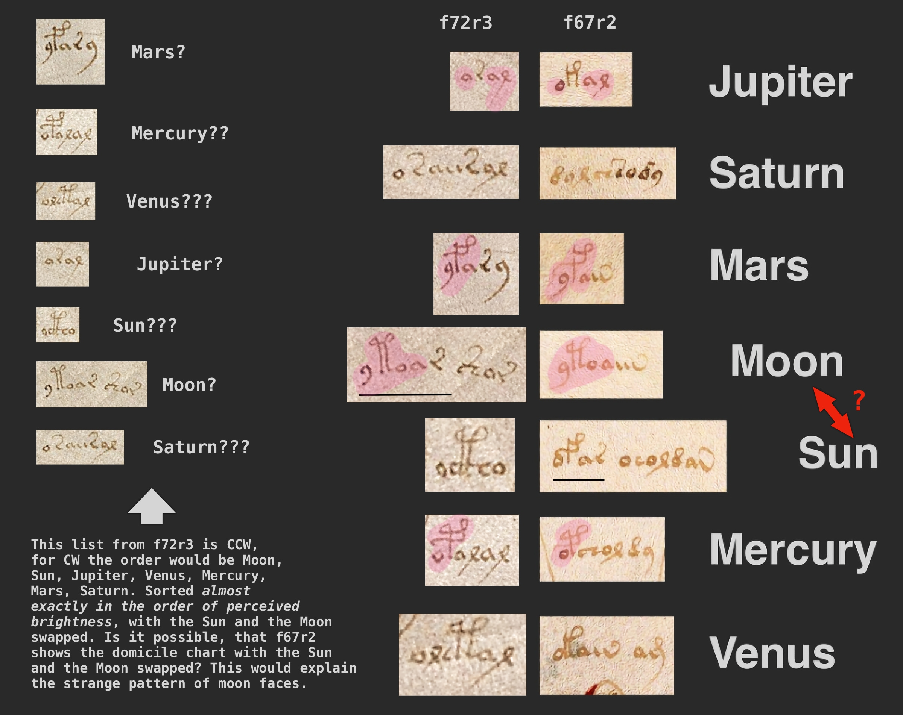

# Interesting labels on f72r3

This is a quick and extremely speculative follow up on the tentative mapping of planet labels that I described [here](./README.md).

My favorite hypothesis on VMS writing is that it is a many-to-many character based scheme, where depending on some unknown factor the same plaintext can be encoded in different ways and at the same time the same transliteration of the encoded text can encode different plaintexts. The unknown factor in question could be the context (page key, preceding text), some feature of the writing system (variation of letter shapes, variation of spacing) or something purely external to the text (idk, distance from the edge or some predefined point of page or even an external grille).

It is possible that a scheme like this would produce partially matching encoded text for the same plaintext, in character sequences or in structure. E.g., when encoding some word one of the outcomes could be BGGKLFGJ, another ACCKLFCJ, with G replaced by C and B by A and the rest of the letters remaining the same.

So, after making a [somewhat plausible astrological](./README.md) mapping between planet labels and planet names on f67r2, I've started poking around for other similar sequences of 7 labels in VMS. I've took what I thought was the tentative label for the Moon _yToaiin_ and searched for it in the transliteration of the manuscipt. The best match I found was _yToar_ on f72r3 (Cancer Zodiac). There are 7 nymphs walking/standing in the cental circle on this page, and there are 7 labels between the nymphs, _yToar_ being part of one of the labels. 

I've started checking other labels to see whether there is any apparent similarity with the planet labels on f67r2. It turns out for 4 of 7 labels on f72r3 (the Moon, Mars, Jupiter and Mercury) it's quite easy to find the most similar label from f67r2, by matching the glyph sequences. I've matched the other 3 by the least dissimilarity (mostly by length).

You can see the result on the following image. On the left hand side the labels from f72r3 are listed in the counter-clockwise order, on the right hand side I've shown how I visually matched them with the labels from f67r2.

What's interesting is if matched like this, the labels on f72r3 go exactly in the order of the brightness, except the Sun and the Moon are swapped. The order is: the Moon, the Sun, Jupiter, Venus, Mercury, Mars, Saturn. Which begs the question, is it possible that the Sun is _yToaiin_ and the Moon is _oFar_? This would explain why the moon faces for the Sun and the Moon are swapped on f67r2, maybe it's beucase the Sun is where the Moon is supposed to be and vice versa. Are there any medieval myths or stories where the Sun and the Moon switch places? Something apocalyptic maybe, explaning the explosion-like feature at the center of f67r2?

The resuling layout would be as follows, the sequence naturally starts with the nymph wearing a crown.

If you need to quote or reference me, you can use my handle [oshfdk](https://twitter.com/oshfdk).

